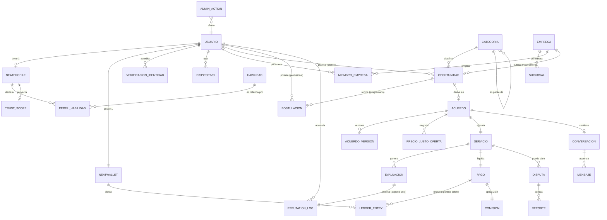
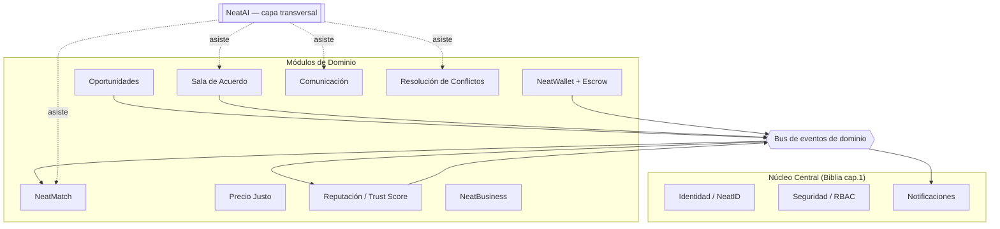
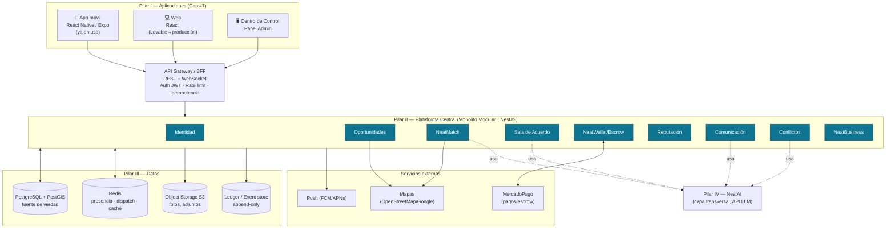
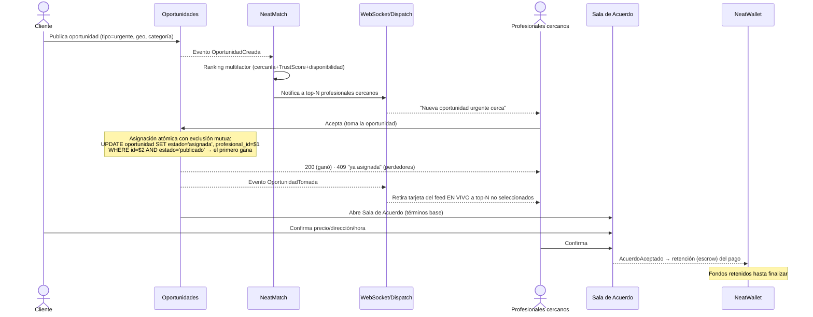
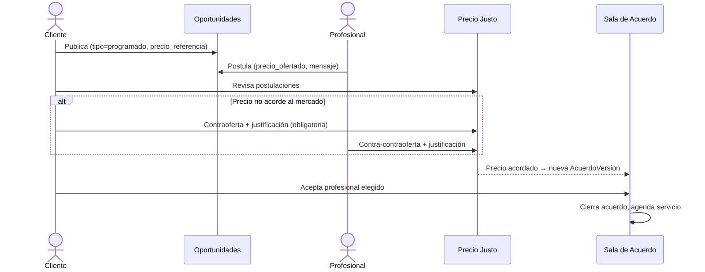
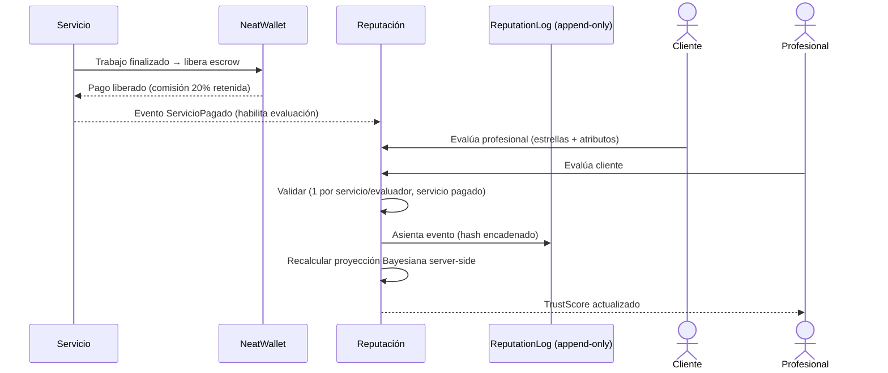

# NeatSpace — Arquitectura Técnica y Diseño de la Solución
### Tomo Técnico I · "El Terreno, la Estructura y el Plano"
**Autor del diseño:** Arquitecto de Software Principal / CTO
**Fuentes:** Libro del Fundador (Manifiesto), Biblia del Desarrollo, prompt bruto de Erick Insuco, mockups (Expo + Lovable).
**Estado:** Borrador base para iterar por componente.

---

## 0. Resumen Ejecutivo — Cómo esta arquitectura garantiza la visión de largo plazo

NeatSpace no es "una app de servicios a domicilio". Según el ADN Estratégico (Cap. 19), es un **ecosistema de oportunidades basado en la confianza**, diseñado para durar cien años (Cap. 77) y para convertir *beneficiarios en generadores de oportunidades* (Cap. 5). Esa ambición impone tres exigencias que dominan cada decisión técnica de este documento:

1. **La confianza es el patrimonio, no un feature.** El `Trust Score™` y el historial de reputación (`NeatProfile™`) se modelan como un **libro contable inmutable y auditable** (event sourcing / append-only), no como un número editable en una tabla. Si la reputación se puede falsificar, el ecosistema muere (Art. III de la Constitución; Principio 11: "la confianza tarda años en construirse y segundos en perderse"). El diseño lo blinda desde el origen.

2. **El dinero exige corrección contable absoluta.** `NeatWallet™` se modela como un **ledger de partida doble** con custodia (escrow) del pago hasta que el trabajo se confirma. La comisión del 20% (visible en los mockups: `$15.000 → –$3.000 → recibe $12.000`) se calcula y retiene server-side, nunca en el cliente.

3. **Crecer por expansión, no por reconstrucción** (Pilar VI, Cap. 47). Se adopta un **Monolito Modular** con fronteras de dominio estrictas (bounded contexts), preparado para extraer `NeatMatch`, `NeatWallet` y `Chat` como servicios independientes cuando la escala lo justifique — sin reescribir el núcleo.

**Cómo cada decisión pasa el filtro del Fundador.** Todo el documento se somete a las tres preguntas del Gobierno (Cap. 13) y a la "Regla de los 3 segundos" / "mínimo esfuerzo" del NeatDesign System (Cap. 44):

| Pregunta del Manifiesto | Respuesta arquitectónica |
|---|---|
| ¿Genera oportunidades? | Motor de equidad en `NeatMatch` que da visibilidad a talento nuevo; onboarding con "primer logro" rápido. |
| ¿Fortalece la confianza? | Reputación inmutable + escrow + identidad verificada + auditoría trazable de toda acción admin. |
| ¿Es ética? | Explicabilidad del matching, anti-sesgo, privacidad por diseño (mínimos datos), IA que asiste pero no decide. |
| ¿Pensar a largo plazo (Cap.16, Principio 7)? | Módulos desacoplados, contratos de API versionados (spec-driven), datos normalizados y clasificados como patrimonio vs. transaccional. |

> **Regla de descarte (Cap. 70 – Constitución del Producto):** cualquier decisión técnica que comprometa la confianza o los valores del Manifiesto se descarta, aunque sea más rápida o barata. Este documento marca esos puntos explícitamente con ⛔.

---

# FASE 1 — EL TERRENO (Análisis de Dominio y Datos)

## 1.1 Dominios funcionales extraídos del Manifiesto

| Dominio (bounded context) | Responsabilidad | Origen en el Manifiesto |
|---|---|---|
| **NeatID / Identidad** | Cuenta, autenticación, verificación, perfil dual | Cap. 61, Biblia cap. 1 (Núcleo Central) |
| **NeatProfile** | Currículum vivo, habilidades, historial | Carta del Fundador, prompt Erick |
| **Trust Score / Reputación** | Puntaje 0–100, evaluaciones, `ReputationLog` | Cap. 74 (Confianza Total), prompt Erick |
| **Oportunidades** | Publicar/buscar trabajos, urgente vs programado | Etapa 2, prompt Erick |
| **NeatMatch** | Motor de emparejamiento multifactor | Cap. 26 |
| **Sala de Acuerdo** | Negociación estructurada + versionado | Cap. 23 |
| **Precio Justo** | Contraoferta justificada (estilo inDrive) | Cap. 23/Economía, prompt Erick |
| **NeatWallet** | Billetera, escrow, comisión, retiros | Etapa 3, prompt Erick |
| **Comunicación** | Chat por oportunidad, notificaciones | Biblia cap. 9 |
| **Resolución de Conflictos** | Reportes, mediación, apelación | Biblia cap. 17 |
| **NeatBusiness** | Empresas, sucursales, equipos, recurrencia | Cap. 37 |
| **NeatAI** | Capa transversal de asistencia | Pilar IV, Cap. 47 |
| **Centro de Control / Admin** | Moderación, auditoría, panel | Cap. 50 |
| **Categorías** | Taxonomía jerárquica de 4 niveles | Biblia cap. 5 |

## 1.2 Modelo Entidad-Relación (MER)

### Diagrama ER (núcleo del MVP + extensión)



### Entidades principales, cardinalidades y restricciones de integridad

| Entidad | Descripción | Relaciones clave (cardinalidad) | Restricciones de integridad |
|---|---|---|---|
| **Usuario** | Persona con **perfil dual** (puede ser cliente y profesional a la vez). | 1—1 NeatWallet; 1—0..1 NeatProfile; 1—N Oportunidad (como cliente); 1—N Postulacion (como profesional). | `email` único; `rut/identidad` único cuando verificado; `estado ∈ {activo, suspendido, congelado}` (Art. IX). No se borra físicamente → *soft delete* (patrimonio de reputación). |
| **NeatProfile** | Currículum vivo. Descripción, habilidades, estudios. | 1—1 Usuario; 1—N PerfilHabilidad; 1—0..1 TrustScore. | Se crea automáticamente al registrarse (prompt Erick). Público por diseño. |
| **Habilidad / PerfilHabilidad** | Habilidades blandas (eficiente, amable…) y técnicas. Escala 0–100. | N—N entre NeatProfile y Habilidad. | El puntaje **no lo escribe el usuario**: es derivado de evaluaciones ⛔ (evita auto-inflado). |
| **TrustScore** | Reputación 0–100 **derivada**, no fuente de verdad. | 1—1 NeatProfile. | Es una *proyección* recomputable desde `ReputationLog`. Solo escritura server-side. |
| **ReputationLog** | **Libro inmutable** de eventos que afectan reputación. | N—1 Usuario; 1—1 Evaluacion (origen). | **Append-only**, encadenado por hash (`hash_prev`), sin UPDATE ni DELETE. Es *Patrimonio*. |
| **Categoria** | Taxonomía jerárquica 4 niveles (Principal→Sub→Especialidad→Competencia). | Auto-referencia 1—N (`parent_id`). | `nivel ∈ {1..4}`; slug único por nivel. |
| **Oportunidad** | Trabajo publicado. `tipo ∈ {urgente, programado}`. | N—1 Usuario(cliente); N—1 Categoria; 1—N Postulacion; 1—0..1 Acuerdo. | `tipo` inmutable tras publicar; `estado` gobernado por máquina de estados; geolocalización obligatoria. |
| **Postulacion** | Oferta de un profesional a una oportunidad *programada*. | N—1 Oportunidad; N—1 Usuario(profesional). | Única por (oportunidad, profesional). Solo válida si `tipo=programado`. |
| **Acuerdo** | Contrato negociado en Sala de Acuerdo. | 1—1 Oportunidad; 1—N AcuerdoVersion; 1—N PrecioJustoOferta; 1—1 Servicio. | Un solo acuerdo *aceptado* por oportunidad; cada modificación crea nueva versión. |
| **AcuerdoVersion** | Snapshot inmutable de términos (precio, fecha, materiales…). | N—1 Acuerdo. | Append-only; la "versión vigente" es la última aceptada por ambas partes. |
| **PrecioJustoOferta** | Contraoferta justificada. | N—1 Acuerdo; N—1 Usuario(emisor). | Debe incluir `monto` + `justificacion` (obligatoria, estilo inDrive). |
| **Servicio** | Ejecución real del trabajo. | 1—1 Acuerdo; 1—1 Pago; 1—N Evaluacion. | Estados: agendado→en_curso→finalizado→pagado→evaluado. |
| **Evaluacion** | Calificación bidireccional post-servicio. | N—1 Servicio; 1—1 ReputationLog. | **Solo existe si el Servicio está pagado** ⛔ (no hay reseña sin transacción real). Una por (servicio, evaluador). Inmutable al enviar. |
| **NeatWallet** | Billetera del usuario. | 1—1 Usuario; 1—N LedgerEntry. | `saldo` = suma de LedgerEntry (nunca campo editable directo). No permite saldo negativo salvo cuenta de sistema. |
| **LedgerEntry** | Asiento contable (partida doble). | N—1 NeatWallet; N—1 Pago. | Todo movimiento tiene contrapartida; `Σ débitos = Σ créditos`. Append-only. |
| **Pago** | Liquidación de un servicio (MercadoPago). | 1—1 Servicio; 1—N LedgerEntry; 1—1 Comision. | Estado escrow: retenido→liberado/reembolsado. `idempotency_key` único. |
| **Comision** | 20% NeatSpace. | 1—1 Pago. | `monto = round(total * 0.20)`; calculada server-side. |
| **Conversacion / Mensaje** | Chat asociado a la oportunidad/acuerdo. | 1—0..1 Acuerdo; 1—N Mensaje. | Historial inmutable ligado al servicio (Biblia cap. 9). |
| **Disputa / Reporte** | Conflicto y evidencias. | N—1 Servicio; 1—N Reporte. | Sigue las 8 etapas (Biblia cap. 17); toda acción trazable. |
| **Empresa / Sucursal / MiembroEmpresa** | NeatBusiness. | 1—N Sucursal; 1—N Miembro; 1—N Oportunidad. | RBAC por rol; "nadie accede a más info de la necesaria" (Cap. 37). |
| **AdminAction** | Acción del Centro de Control. | N—1 Usuario afectado; N—1 Admin. | **Toda acción admin es registrada y trazable** (Art. IX, Cap. 50). Append-only. |

## 1.3 Modelo Relacional (MR) — esquema normalizado (3NF)

Notación: **PK** clave primaria, *FK* foránea, `↑IDX` índice sugerido, `UQ` único.

```
usuario(
  id PK, email UQ, telefono, hash_password, nombre, apellido,
  estado, es_cliente bool, es_profesional bool, creado_en, actualizado_en
)  ↑IDX(email), ↑IDX(estado)

neatprofile(
  id PK, usuario_id FK→usuario UQ, descripcion, ubicacion_base geography(POINT),
  radio_cobertura_km, idiomas jsonb, publicado bool
)  ↑IDX GIST(ubicacion_base)   -- PostGIS para NeatMatch por cercanía

habilidad( id PK, nombre UQ, tipo /* blanda|tecnica */, categoria_id FK→categoria NULL )

perfil_habilidad(
  neatprofile_id FK, habilidad_id FK, puntaje_0_100 int,   -- DERIVADO
  PRIMARY KEY(neatprofile_id, habilidad_id)
)

trust_score(
  neatprofile_id PK FK→neatprofile, valor_0_100 numeric,
  n_evaluaciones int, valor_bayesiano numeric, recalculado_en
)  ↑IDX(valor_0_100)  -- ranking en NeatMatch

reputation_log(
  id PK, usuario_id FK, evento /* eval|sancion|verificacion|apelacion */,
  delta numeric, evaluacion_id FK NULL, hash_prev, hash_actual, creado_en
)  ↑IDX(usuario_id, creado_en)   -- APPEND-ONLY, sin UPDATE/DELETE

categoria(
  id PK, parent_id FK→categoria NULL, nivel int /*1..4*/, nombre, slug, emoji, activa bool
)  ↑IDX(parent_id), UQ(parent_id, slug)

oportunidad(
  id PK, cliente_id FK→usuario, categoria_id FK→categoria, empresa_id FK→empresa NULL,
  titulo, descripcion, tipo /* urgente|programado */, estado,
  ubicacion geography(POINT), direccion_texto, fecha_programada NULL,
  precio_referencia int, creado_en
)  ↑IDX GIST(ubicacion), ↑IDX(estado, tipo), ↑IDX(categoria_id)

postulacion(
  id PK, oportunidad_id FK, profesional_id FK→usuario, mensaje, precio_ofertado int, estado,
  creado_en, UQ(oportunidad_id, profesional_id)
)  ↑IDX(oportunidad_id)

acuerdo(
  id PK, oportunidad_id FK UQ, profesional_id FK→usuario, estado, version_vigente int, creado_en
)

acuerdo_version(
  id PK, acuerdo_id FK, version int, precio_final int, fecha_servicio, hora,
  direccion, duracion_estimada, materiales jsonb, condiciones, aceptado_cliente bool,
  aceptado_profesional bool, creado_en,
  UQ(acuerdo_id, version)
)  ↑IDX(acuerdo_id)

precio_justo_oferta(
  id PK, acuerdo_id FK, emisor_id FK→usuario, monto int, justificacion text NOT NULL,
  estado /* propuesta|aceptada|rechazada|contraofertada */, creado_en
)  ↑IDX(acuerdo_id)

servicio(
  id PK, acuerdo_id FK UQ, estado, iniciado_en, finalizado_en
)  ↑IDX(estado)

evaluacion(
  id PK, servicio_id FK, evaluador_id FK→usuario, evaluado_id FK→usuario,
  estrellas int /*1..5*/, atributos jsonb /* {amable, rapido, ...} */, comentario,
  creado_en, UQ(servicio_id, evaluador_id)
)  ↑IDX(evaluado_id)

neatwallet(
  id PK, usuario_id FK→usuario UQ NULL, empresa_id FK→empresa UQ NULL,
  tipo /* usuario|empresa|sistema */, rol_sistema /* escrow|comision_neatspace|ingresos|reembolsos */ NULL,
  moneda default 'CLP', creado_en
)  -- usuario_id/empresa_id son NULL en cuentas de sistema (escrow, comisión, ingresos);
   -- CHECK: exactamente una identidad poblada por fila (usuario XOR empresa XOR cuenta de sistema).
   -- Empresa paga con wallet corporativo propio (1—1 Empresa↔NeatWallet), no con el wallet del miembro que publica.

ledger_entry(
  id PK, wallet_id FK→neatwallet, pago_id FK→pago NULL, tipo /* debito|credito */,
  monto int, concepto, referencia_idempotencia, creado_en
)  ↑IDX(wallet_id, creado_en)   -- APPEND-ONLY; saldo = Σ(credito) - Σ(debito)

pago(
  id PK, servicio_id FK UQ, total int, estado /* retenido|liberado|reembolsado */,
  proveedor /* mercadopago */, proveedor_ref, idempotency_key UQ, creado_en
)  ↑IDX(estado)

comision( id PK, pago_id FK UQ, monto int, porcentaje numeric default 0.20 )

conversacion( id PK, acuerdo_id FK NULL, oportunidad_id FK, creado_en )
mensaje(
  id PK, conversacion_id FK, emisor_id FK→usuario, cuerpo, adjuntos jsonb, leido bool, creado_en
)  ↑IDX(conversacion_id, creado_en)

disputa( id PK, servicio_id FK, abridor_id FK→usuario, estado, num_caso UQ, creado_en )
reporte( id PK, disputa_id FK NULL, reportante_id FK, reportado_id FK, motivo, evidencias jsonb, creado_en )

empresa( id PK, razon_social, nombre_comercial, giro, verificada bool, trust_score_emp numeric )
sucursal( id PK, empresa_id FK, nombre, ubicacion geography(POINT), direccion )
miembro_empresa( id PK, empresa_id FK, usuario_id FK, rol, permisos jsonb, UQ(empresa_id, usuario_id) )

oportunidad_recurrente(   -- plantilla de recurrencia (NeatBusiness, Cap.37)
  id PK, cliente_id FK→usuario NULL, empresa_id FK→empresa NULL, categoria_id FK→categoria,
  titulo, descripcion, tipo, ubicacion geography(POINT), direccion_texto,
  periodicidad /* diaria|semanal|quincenal|mensual */, dia_semana NULL, dia_mes NULL,
  hora, activa bool, proxima_ejecucion, creado_en
)  -- genera Oportunidad concretas según schedule; oportunidad.recurrente_id FK NULL enlaza cada instancia

verificacion_identidad( id PK, usuario_id FK, nivel, metodo, estado, verificado_en )
dispositivo( id PK, usuario_id FK, fingerprint, push_token, ultimo_acceso, confiable bool )
admin_action( id PK, admin_id FK→usuario, usuario_afectado_id FK NULL, accion, motivo, payload jsonb, creado_en )  -- APPEND-ONLY
notificacion( id PK, usuario_id FK, tipo, payload jsonb, leida bool, creado_en )
```

**Asientos de partida doble (cuentas de sistema como contrapartida).** Cada operación de dinero mueve fondos entre wallets con `Σ débitos = Σ créditos` globalmente. Las cuentas de sistema (`escrow`, `comision_neatspace`, `ingresos`, `reembolsos`) son las contrapartidas obligatorias — sin ellas un crédito al profesional no tendría de dónde debitarse:

| Operación | Débito | Crédito |
|---|---|---|
| Retención en escrow (`/pay`) | Wallet cliente (o cargo externo MercadoPago) | Cuenta `escrow` |
| Liberación al profesional (`/release`) | Cuenta `escrow` | Wallet profesional (neto) **+** Cuenta `comision_neatspace` (20%) |
| Reembolso (`Pago→reembolsado`) | Cuenta `escrow` | Wallet cliente |
| **Reverso de comisión ante reembolso** | Cuenta `comision_neatspace` | Wallet cliente / `reembolsos` |

**Política de comisión ante reembolso.** Si el reembolso ocurre antes de la liberación (fondos aún en `escrow`), la comisión no se devengó y no se asienta. Si ocurre tras liberar, se genera un **asiento de reverso** que revierte la comisión (total si el servicio no se prestó; parcial según la etapa de disputa), coherente con el patrón "se corrige con un nuevo asiento (reverso)" de §1.4 — nunca se edita el `LedgerEntry` ni la `Comision` originales.

**Índices prioritarios para NeatMatch** (la búsqueda más caliente):
- `GIST(oportunidad.ubicacion)` y `GIST(neatprofile.ubicacion_base)` → consultas por radio (`ST_DWithin`).
- `trust_score.valor_0_100 DESC` → ordenamiento por reputación.
- Índice compuesto `(estado, tipo, categoria_id)` en `oportunidad` → feed "EN VIVO" de urgentes por categoría.
- Índice parcial `WHERE estado='publicado'` para reducir el conjunto de trabajo.
- *(Placeholder de equidad)* índice parcial sobre `trust_score.n_evaluaciones` bajo (perfiles con poco historial) o un segundo criterio de ordenamiento, para no pre-sesgar la capa de datos hacia el ranking puro por reputación antes de que el deep-dive de NeatMatch defina la ponderación de equidad (Cap. 26). El orden `valor_0_100 DESC` no debe ser el único acceso disponible.

## 1.4 Mapa de Datos — Patrimonio vs. Transaccional

> Principio rector (Art. III + Cap. 74): *"La confianza será un patrimonio que no podrá comprarse; solo construirse y protegerse."* Los datos-patrimonio son **inmutables, encadenados y auditables**; los transaccionales son mutables y de ciclo de vida corto.

| Clase | Entidades | Tratamiento técnico |
|---|---|---|
| **🏛️ PATRIMONIO** (inmutable / trazable / auditable) | `ReputationLog`, `Evaluacion` (al enviarse), `AcuerdoVersion` aceptadas, `LedgerEntry`, `Pago/Comision`, `VerificacionIdentidad`, `AdminAction`, `Mensaje` (historial legal del servicio), `Disputa/Resolucion` | Append-only. Sin UPDATE/DELETE. Encadenamiento por hash donde aplica. Backups WORM. Retención larga. Recomputables (event sourcing): el `TrustScore` y el `saldo` se derivan y pueden reconstruirse desde cero. Base de la evidencia en conflictos. |
| **🔄 TRANSACCIONAL** (mutable / operativo) | `Oportunidad`(estado), `Acuerdo`(estado/version_vigente), `Servicio`(estado), `Postulacion`, `Notificacion`, `Dispositivo`, sesión, ubicación en vivo, borradores de chat, caché de matching | Mutable con optimistic locking. Ciclo de vida corto. Puede purgarse/expirar. Se apoya en Redis para estado efímero (presencia, dispatch de urgentes). |
| **📊 DERIVADO** (proyección de patrimonio) | `TrustScore`, `perfil_habilidad.puntaje`, `neatwallet.saldo`, dashboards/analytics | Nunca es fuente de verdad. Recalculable. Si hay discrepancia, gana el log-patrimonio. |

**Excepción declarada de estado acotado (append-only ≠ inmutabilidad total del registro).** El **contenido de negocio** de `Mensaje` (cuerpo, adjuntos, emisor) y de `AcuerdoVersion` (precio, fecha, términos) es inmutable: no admite UPDATE ni DELETE. Sí se admiten, como excepción explícita y acotada, campos de **estado de entrega/aceptación** sobre esas mismas filas: `mensaje.leido` y `acuerdo_version.aceptado_cliente/aceptado_profesional`. Estos flags no alteran el hecho histórico ni la cadena de hashes; señalan una transición de estado del propio registro. *(Alternativa preferida a futuro: extraer ese estado a tablas append-only —`mensaje_lectura(mensaje_id, usuario_id, leido_en)` y `acuerdo_version_aceptacion(version_id, usuario_id, creado_en)`— para lograr inmutabilidad estricta también en el estado.)*

**Consecuencia de diseño:** una calificación, un pago o una sanción **nunca se editan**: se *corrigen con un nuevo asiento* (reverso). Esto satisface a la vez la Constitución (Art. V transparencia, Art. IX debido proceso) y la exigencia financiera de auditabilidad.

> ⛔ **Doble autorización (maker-checker) para reversos.** El encadenamiento por hash prueba la integridad de la cadena, no la *legitimidad* de un asiento nuevo: un solo actor interno podría insertar un reverso fraudulento sin romper la cadena. Por eso todo **reverso manual de `LedgerEntry`** o **entrada correctiva en `ReputationLog`** exige aprobación de **dos administradores distintos** (segregación de funciones), se registra como `AdminAction` con motivo obligatorio, y dispara **alertas automáticas** cuando el reverso excede umbrales de monto o frecuencia. Cierra el vector de fraude *insider* en el activo más sensible.

---

# FASE 2 — LA ARQUITECTURA (La Estructura)

## 2.1 Estrategia modular — Decisión: **Monolito Modular evolutivo**

**Decisión:** iniciar como **Monolito Modular** (un solo despliegue, base de datos compartida con *esquemas por módulo*, fronteras de dominio estrictas y comunicación por interfaces internas + eventos de dominio), con un plan explícito de **extracción a microservicios** por módulo cuando la métrica lo exija.

**Justificación bajo el principio de escalabilidad (Pilar VI, Cap. 47 — "crecer por expansión, no por reconstrucción"):**

- **MVP y equipo pequeño (Regla del MVP, Cap. 56):** microservicios desde el día 1 impondrían complejidad operativa (red, observabilidad distribuida, consistencia eventual) que retrasa el "primero, ser útiles en Chile" (Cap. 29). ⛔ Se descarta microservicios prematuros.
- **Fronteras listas para cortar:** cada módulo (`identidad`, `oportunidades`, `neatmatch`, `sala_acuerdo`, `neatwallet`, `reputacion`, `comunicacion`, `conflictos`, `neatbusiness`, `neatai`) expone **solo una interfaz pública** y publica **eventos de dominio** (`ServicioPagado`, `EvaluacionEnviada`, `AcuerdoAceptado`). Nada accede a las tablas de otro módulo directamente. Esto es lo que permite "evolucionar sin detener la plataforma" (Cap. 47).
- **Orden de extracción cuando escale** (candidatos por carga y aislamiento de riesgo):
  1. `NeatMatch` (CPU/geo intensivo, escala independiente).
  2. `NeatWallet` (aislamiento de seguridad financiera y cumplimiento).
  3. `Comunicación/Chat` (conexiones WebSocket masivas).
- **Coherencia con "pensar a largo plazo" (Cap. 16, Principio 7):** el contrato de eventos y las APIs versionadas (spec-driven, §3.3) hacen que extraer un servicio sea *mover código detrás del mismo contrato*, no reescribir.



## 2.2 Diagrama de Arquitectura del sistema



**Capas y responsabilidades**
- **Frontend:** Expo/React Native (móvil, ya construido) + React web. Consumen el mismo BFF; misma identidad visual (NeatDesign System, §Fase 3.5).
- **BFF / Gateway:** autenticación JWT + refresh, rate-limiting, **idempotencia** (crítico en pagos), traducción REST↔dominio, canal WebSocket para tiempo real (urgentes + chat).
- **Backend (Pilar II):** monolito modular en **NestJS/TypeScript** (mapea 1:1 los módulos del Manifiesto).
- **Datos (Pilar III):** PostgreSQL+PostGIS (verdad transaccional y geo), Redis (efímero/tiempo real), Object Storage (archivos), event store append-only (patrimonio).
- **NeatAI (Pilar IV):** capa transversal que *asiste* (redacción, resumen, detección de cláusulas ambiguas, explicabilidad del match, priorización de casos) pero **no decide** (Cap. 23, 26, 50). Dos defensas obligatorias en esta capa de integración:
  - **Entradas de usuario como no confiables:** mensajes, evidencias de disputa y justificaciones de Precio Justo se tratan como contenido no confiable. Separación estricta entre *instrucciones de sistema* y *contenido de usuario*, filtrado y registro de intentos de **prompt injection**, y **ninguna salida de NeatAI ejecuta acciones automáticas** sobre disputas o Trust Score sin revisión humana (refuerza "asiste, no decide").
  - **Minimización antes del LLM externo:** paso previo de **anonimización/redacción** de datos personales antes de enviarlos al proveedor LLM, más el **DPA** correspondiente y la mención de esta **transferencia internacional** en el aviso de privacidad (ver §2.4).
- **Seguridad (Pilar V) y Escalabilidad (Pilar VI):** transversales, ver §2.3 y §2.1.

## 2.3 Seguridad y Confianza — "Seguridad desde el origen" (Cap. 13 Biblia + Pilar V)

### 2.3.1 Protección del Trust Score contra manipulación (requisito crítico)

El Trust Score es el activo más atacable (comprar reputación, reseñas falsas, colusión). Defensa en capas:

1. **No hay reseña sin transacción real** ⛔ — `Evaluacion` solo puede crearse si existe un `Servicio` en estado `pagado` vía escrow liberado. Elimina el spam de reseñas de base.
2. **Reputación como log inmutable encadenado** — cada evento entra en `ReputationLog` con `hash_actual = H(hash_prev ‖ payload)`. Cualquier alteración rompe la cadena y es detectable en auditoría. El `TrustScore` es una **proyección recomputable**, nunca un número que un endpoint pueda "setear".
3. **Cálculo 100% server-side** — el cliente jamás envía el puntaje; solo envía estrellas/atributos de una evaluación válida. Toda fórmula corre en el módulo `Reputación`.
4. **Media bayesiana anti "5 estrellas con 1 reseña"** — `valor = (C·m + Σstars) / (C + n)`, donde `m` es la media global y `C` un peso de credibilidad. Un profesional nuevo no aparece con 100/100 tras un solo trabajo (equidad + anti-manipulación). **Estado de UI para el *cold start*:** cuando el profesional aún no tiene evaluaciones representativas, la interfaz muestra un badge **"Nuevo en NeatSpace" / "Sin historial aún"** en lugar de un número bajo o vacío — mostrar un score bajo desalentaría contratar talento nuevo, contradiciendo el objetivo del Manifiesto de dar visibilidad a talento nuevo ("¿Genera oportunidades?").
5. **Ponderación por confianza del evaluador y recencia** — evaluaciones de cuentas verificadas y recientes pesan más; se decae el peso de evaluaciones muy antiguas.
6. **Anti-colusión (NeatAI + reglas)** — detección de anillos recíprocos (A↔B se califican en bucle), velocidad anómala, mismos dispositivos/IP/geo, patrones de auto-contratación. Marca para revisión humana (nunca sanción automática ciega — debido proceso, Art. IX).
7. **Identidad verificada proporcional** (Pilar I, Cap. 74) — verificación por niveles según el servicio; sube el peso reputacional y habilita categorías sensibles.
8. **Rate limiting e idempotencia** en endpoints de evaluación y pago.
9. **Evaluación bidireccional a ciegas (double-blind)** — la calificación de cada parte permanece **oculta** hasta que **ambas** la envíen (o hasta que expire una ventana de tiempo), tras lo cual se publican **simultáneamente**. Sin ocultamiento simultáneo existe un vector de coerción/represalia: quien ve la nota primero puede usar la amenaza de mala calificación como palanca, contaminando la integridad del Trust Score.
10. **Detección de desintermediación** — reglas deterministas + NeatAI marcan patrones de contacto fuera de banda en `Mensaje` (números de teléfono, cuentas bancarias, apps externas, frases tipo "te pago directo"). Es el vector de fraude más directo contra el modelo de negocio y contra la misión de confianza: un trabajo pagado fuera de la plataforma no tiene escrow ni `ReputationLog` verificable. Marcado para revisión y posible **degradación temporal de visibilidad** para reincidentes — nunca sanción automática ciega (debido proceso, Art. IX).

### 2.3.2 Seguridad general (12 pilares, Biblia cap. 13)
- Cifrado en tránsito (TLS) y en reposo; datos sensibles cifrados a nivel de campo.
- 2FA para operaciones sensibles (retiros, cambios de identidad).
- RBAC estricto en NeatBusiness y Centro de Control ("nadie accede a más de lo necesario", Cap. 37/50).
- Detección de accesos inusuales, gestión de dispositivos, cierre remoto de sesión.
- **Auditoría permanente:** toda `AdminAction` es append-only y trazable (Art. IX, Cap. 50).
- Privacidad por diseño: se recolecta el mínimo dato necesario (Biblia cap. 13, pilar 6).

## 2.4 Protección de Datos Personales (Ley 21.719)

El append-only es la base de la auditabilidad, pero convive con la Ley 21.719 (vigente desde dic. 2026: base de licitud, retención, transferencias internacionales, datos sensibles) y con la promesa de "privacidad por diseño (mínimos datos)" de §0. Varias entidades clasificadas como patrimonio inmutable (`Mensaje`, `ReputationLog`, `VerificacionIdentidad`, `AdminAction`) contienen PII. Como la estructura de datos debe decidirse ahora (migrarla en producción es costoso), esta capa reconcilia ambos objetivos:

- **(a) Separar contenido inmutable de negocio y datos personales.** El contenido de negocio (montos, hashes, deltas, estados) permanece inmutable y encadenado; los datos personales (nombre, cuerpo de `Mensaje`, metadatos de dispositivo) se referencian por **ID estable** pero admiten **pseudonimización/tokenización** de campos de texto libre ante solicitudes de eliminación, **preservando la integridad de la cadena de hashes y la partida doble** (se conserva el evento y su hash; se tokeniza el contenido personal).
- **(b) Clasificar por sensibilidad.** Marcar `geolocalización` y `dispositivo.fingerprint` como sensibles; si `verificacion_identidad` usa biometría, tratarla como **dato sensible** con cifrado reforzado.
- **(c) Políticas de retención por tipo de dato.** Reemplazar la "Retención larga" indefinida de §1.4 por **plazos explícitos por categoría** (evidencia legal de servicio, PII de chat, metadatos técnicos), respetando la minimización.
- **(d) DPA y transferencia internacional.** Documentar los DPA y el análisis de transferencia internacional para terceros que reciben datos (**MercadoPago**, **LLM de NeatAI**).

## 2.5 Estructura legal y regulatoria (Chile) — consideraciones abiertas

> Consideraciones para revisión legal, no afirmaciones definitivas en un borrador técnico. Se dejan explícitas porque condicionan el modelo de datos y deben decidirse temprano. Referenciada desde §3.2 "Pagos" y §2.2.

- **(a) Custodia de fondos.** Precisar si se usa la API de *marketplace/split payments* de MercadoPago para que los fondos **nunca transiten por cuenta propia de NeatSpace**, o si se requiere encuadre bajo la **Ley Fintech 21.521** ante la CMF. Marcar este límite de custodia en el diagrama §2.2, entre `M5/NeatWallet` y MercadoPago.
- **(b) Obligaciones tributarias (SII).** Agregar una entidad `DocumentoTributario` ligada a `Pago`/`Comision` (boleta/factura electrónica) y contemplar en el flujo `release` la **retención previsional** del prestador y el comprobante fiscal (IVA sobre comisión, **Ley 21.713**).
- **(c) Ley 21.431 (trabajadores de plataformas).** Definir el vínculo contractual con los profesionales y qué información algorítmica (peso de `TrustScore`, criterios de ranking) se expone al profesional, para cumplir la **transparencia algorítmica** exigida.
- **(d) Ley 19.496 (consumidor).** Cláusula sobre el rol de **intermediación** de NeatSpace frente al consumidor.
- **(e)** Registrar la **dependencia de un único proveedor de pagos** como riesgo de negocio aceptado.

---

# FASE 3 — EL PLANO (Funcional y Técnico)

## 3.1 Casos de uso críticos + diagramas de secuencia

### Flujo A — Publicar y resolver un servicio **URGENTE** (estilo Uber)



**Exclusión mutua y trazabilidad de la aceptación urgente.** Al ser el flujo de mayor concurrencia, la asignación se resuelve con una **transición atómica condicional** (`UPDATE ... WHERE estado='publicado'`): sólo una fila cambia de estado, el primero en aceptar gana y los demás reciben `409 / "ya asignada"` — se evita la doble asignación que violaría la cardinalidad `Oportunidad 1—0..1 Acuerdo`. El evento de dominio `OportunidadTomada` dispara el push en tiempo real a los profesionales top-N no seleccionados y **retira la tarjeta del feed EN VIVO**. Como `Postulacion` sólo es válida para `tipo=programado`, la aceptación urgente se registra en una entidad auditable propia —`aceptacion_urgente(oportunidad_id, profesional_id, creado_en)` (o generalizando `Postulacion` a ambos tipos)— para poblar `acuerdo.profesional_id` y poder reconstruir quién ganó.

### Flujo B — Servicio **PROGRAMADO** con **Precio Justo** (contraoferta estilo inDrive)



### Flujo C — **Cálculo del Trust Score** tras finalizar (protegido)



**Máquina de estados de liberación de escrow (confirmación dual + auto-liberación).** "Trabajo finalizado → libera escrow" no es un salto único: la liberación de fondos exige autorización explícita por rol para cerrar dos vectores de fraude simétricos —el cliente que retiene fondos rehusando confirmar y el profesional que auto-libera sin trabajo verificado. Reglas:

- `/services/{id}/finish` lo invoca **el profesional** y marca `finalizado`; abre una **ventana de disputa de N horas**.
- `/services/{id}/release` se autoriza si (a) **el cliente confirma recepción** dentro de la ventana, o (b) vence la ventana **sin objeción ni disputa** del cliente → **auto-liberación**. Si el cliente abre `disputa` dentro de la ventana, el escrow queda congelado hasta la resolución (Flujo de Conflictos, Biblia cap. 17).
- Ningún rol libera unilateralmente fuera de estas transiciones; toda liberación queda asentada en `LedgerEntry` (partida doble) y es auditable. Es el núcleo de la confianza financiera que §0 declara innegociable.

## 3.2 SDD — Stack Tecnológico propuesto

| Capa | Tecnología | Justificación (valores del Manifiesto) |
|---|---|---|
| **Móvil** | **React Native + Expo** | Ya en uso en el prototipo; un código para iOS+Android (Pilar I). Rápido de iterar (Regla del MVP). |
| **Web** | **React + TypeScript** | El prototipo Lovable genera React; reutiliza componentes y design system. |
| **Backend** | **Node.js + NestJS (TypeScript)** | Modularidad de primera clase (módulos = bounded contexts del Manifiesto); mismo lenguaje que el front (equipo pequeño); ecosistema maduro. |
| **DB principal** | **PostgreSQL 16 + PostGIS** | ACID para dinero (NeatWallet), geo para NeatMatch, JSONB para flexibilidad. Una sola verdad. |
| **Tiempo real / caché** | **Redis** | Presencia, dispatch de urgentes, colas ligeras, rate-limit. |
| **Tiempo real cliente** | **WebSocket (Socket.IO)** | Feed "EN VIVO", chat, "profesional en camino". |
| **Archivos** | **S3-compatible (MinIO/AWS S3)** | Fotos del trabajo, adjuntos, comprobantes. |
| **Pagos** | **MercadoPago (Checkout + escrow)** | Ya elegido en mockups; estándar en Chile. Comisión 20% aplicada server-side. |
| **Mapas** | **OpenStreetMap (Leaflet/MapLibre)** + fallback Google | OSM ya usado (Expo) y sin costo por volumen; unificar criterio. |
| **IA (NeatAI)** | **API LLM (Claude)** para asistencia | Redacción/resumen/detección de cláusulas/priorización. *Asiste, no decide.* |
| **Auth** | **JWT + refresh, Argon2, 2FA (TOTP)** | Seguridad desde el origen (Pilar V). |
| **Infra** | Contenedores (Docker) + Postgres gestionado + CDN | Alta disponibilidad razonable sin sobre-ingeniería para el MVP. |
| **Observabilidad** | Logs estructurados, tracing, auditoría append-only | "Rendir cuentas" (Cap. 13); trazabilidad admin. |
| **Accesibilidad** | **WCAG 2.1 AA** + librería de componentes con accesibilidad nativa + **gate de CI** | Requisito no funcional de primera clase, no backlog: Cap. 44 — "la accesibilidad nunca será una actualización futura; será parte del diseño desde el primer día". El gate incluye *linting* de accesibilidad y pruebas de flujos críticos con lector de pantalla antes de producción. |

> **Recomendación de convergencia de prototipos:** unificar la navegación en **`Explorar/Inicio · Trabajos · Wallet · Perfil`** (el patrón de Lovable ya incluye Wallet como tab de primer nivel, coherente con que NeatWallet es un dominio central) y mover "Publicar" a un botón de acción flotante contextual.

## 3.3 API Design — endpoints clave (cliente ↔ profesional)

Convención: REST, versionado `/v1`, JSON, autenticación `Bearer`, `Idempotency-Key` obligatorio en escritura de dinero.

```
# Identidad / NeatProfile
POST   /v1/auth/register            # crea usuario + NeatProfile + NeatWallet (atómico)
POST   /v1/auth/login
GET    /v1/profiles/{id}            # NeatProfile público (currículum vivo)
PATCH  /v1/me/profile               # descripción, habilidades declaradas, cobertura

# Categorías
GET    /v1/categories?level=1&parent=

# Oportunidades
POST   /v1/opportunities           # {tipo, categoria, geo, precio_ref, fecha?}
GET    /v1/opportunities?type=urgent&near=lat,lng&radius=&category=   # feed EN VIVO
GET    /v1/opportunities/{id}
POST   /v1/opportunities/{id}/applications      # postular (programado)
GET    /v1/opportunities/{id}/applications      # cliente revisa postulaciones

# NeatMatch
GET    /v1/opportunities/{id}/matches           # top profesionales sugeridos + explicación

# Precio Justo
POST   /v1/agreements/{id}/price-offers         # {monto, justificacion*}  (contraoferta)
POST   /v1/agreements/{id}/price-offers/{oid}/accept

# Sala de Acuerdo
POST   /v1/opportunities/{id}/agreement         # abre sala
POST   /v1/agreements/{id}/versions             # nueva versión de términos
POST   /v1/agreements/{id}/accept               # aceptación por parte (cliente/profesional)

# Servicio + estado
POST   /v1/services/{id}/start
POST   /v1/services/{id}/finish

# NeatWallet / Pagos
GET    /v1/wallet                                # saldo (derivado) + movimientos
POST   /v1/wallet/topup                          # abonar (MercadoPago)
POST   /v1/services/{id}/pay                     # SOLO inicia el intento → 'pendiente' (Idempotency-Key)
POST   /v1/services/{id}/release                 # libera al profesional (comisión 20%)
POST   /v1/wallet/withdraw                       # retiro (2FA)
POST   /v1/webhooks/mercadopago                  # fuente de verdad del estado de Pago (asíncrono)

# Reputación
POST   /v1/services/{id}/reviews                 # evaluar (solo si pagado)
GET    /v1/profiles/{id}/trust-score

# Comunicación / Conflictos
GET    /v1/agreements/{id}/messages   ·  POST .../messages
POST   /v1/services/{id}/disputes
```

**Reglas de negocio embebidas en la API (no negociables):**
- `POST /reviews` → 409 si el servicio no está `pagado`.
- `POST /price-offers` → 422 si falta `justificacion`.
- `POST /pay` sin `Idempotency-Key` → 400.
- Comisión nunca viaja desde el cliente: se deriva server-side de `total`.
- `POST /pay` **solo inicia el intento** y retorna `pendiente`; la confirmación real llega por webhook (los PSP confirman de forma asíncrona, no síncrona). `GET /v1/opportunities` y el detalle de profesional **no** exponen `trust_score` como número editable.
- **Geolocalización enmascarada:** en el feed y en `GET /v1/opportunities` se expone solo geolocalización aproximada (radio/zona); la `direccion_texto` exacta se revela al profesional **únicamente** cuando el `Acuerdo` está aceptado o el servicio urgente fue asignado. Al ser un servicio a domicilio, exponer la dirección del hogar a un conjunto amplio de candidatos antes de la selección es un riesgo de seguridad física, no solo de UX.

**Webhook de MercadoPago como fuente de verdad del dinero.** `POST /v1/webhooks/mercadopago` es quien transiciona el estado de `Pago` (`retenido→liberado/reembolsado`) y contempla los estados intermedios del proveedor (`pendiente`, `en revisión`, `contracargo`). Requisitos de blindaje (superficie de fraude si no se protege): **verificación de firma/HMAC**, **idempotencia** y **protección contra replay** (una doble notificación no debe duplicar asientos), y un **job de reconciliación periódica** que compare el estado real en MercadoPago contra `pago.estado` para evitar que el escrow —"fuente de verdad del dinero" (§0)— se desincronice del proveedor.

## 3.4 Spec-Driven — estructura OpenAPI para consistencia entre módulos

Contrato **OpenAPI 3.1** como fuente única de verdad de las interfaces; genera clientes tipados (front móvil/web) y valida requests/responses. Estructura sugerida del repositorio de specs:

```
/api-spec
  openapi.yaml                 # raíz: info, servers, security (bearer), tags por módulo
  /components
    schemas/
      Usuario.yaml  NeatProfile.yaml  Oportunidad.yaml  Acuerdo.yaml
      PrecioJustoOferta.yaml  Pago.yaml  Evaluacion.yaml  TrustScore.yaml
    responses/   Error.yaml  Paginated.yaml
    parameters/  GeoQuery.yaml  Pagination.yaml
  /paths
    identidad.yaml  oportunidades.yaml  neatmatch.yaml  sala-acuerdo.yaml
    precio-justo.yaml  neatwallet.yaml  reputacion.yaml  comunicacion.yaml
  /events                       # AsyncAPI para eventos de dominio (bus)
    ServicioPagado.yaml  AcuerdoAceptado.yaml  EvaluacionEnviada.yaml
```

- **Contract-first:** ningún módulo consume a otro sino a través del schema publicado (habilita la futura extracción a microservicios sin romper clientes).
- **Versionado semántico** de la spec; cambios breaking → `/v2`. Coherente con "pensar a largo plazo" (Cap. 16).
- **AsyncAPI** documenta los eventos de dominio con el mismo rigor que REST.

## 3.5 Validación contra el NeatDesign System (Cap. 44)

- **Regla de los 3 segundos:** cada endpoint del feed devuelve lo mínimo para renderizar la tarjeta sin llamadas extra (evita spinners encadenados).
- **Regla del mínimo esfuerzo (dos capas):** validar por separado (1) los **pasos de API** —ya cubierto: "Publicar", "Aceptar", "Cobrar" son ≤ 2 endpoints server-side, compuestos donde aplica— y (2) los **pasos de UI percibidos por el usuario**, verificando contra el mockup real cuántos taps/pantallas requiere cada acción. Confundir simplicidad de backend con simplicidad percibida da una falsa sensación de cumplimiento de la Regla de los 3 segundos.
- **Diseño emocional:** eventos de dominio (`PrimerServicioCompletado`, `PrimerPagoRecibido`) disparan las celebraciones ("¡Gracias por calificar!", visto en mockups).
- **Consistencia:** estados de dominio (`publicado`, `esperando trabajador`, `completado`, `pagado`) mapean 1:1 a los badges de color del design system.

---

## 4. Análisis de Mockups vs. principios del NeatDesign System

**Fortalezas observadas** (ya cumplen el Manifiesto):
- Pantalla de bienvenida centrada en la persona ("¿Qué necesitas hoy?", dos caminos claros `Necesito ayuda` / `Quiero trabajar`) → coherente con Cap. 61 ("preguntamos qué necesita, no quién es").
- Transparencia del dinero: el desglose `Total / Comisión NeatSpace 20% / Recibes` es explícito y honesto (Art. V, Pilar III).
- Jerarquía visual correcta: la oportunidad/acción principal domina; badges de estado consistentes.
- Celebración emocional ("¡Gracias por calificar!") alineada con "celebraremos el trabajo, no el dinero" (Cap. 44).

**Brechas / elementos de UI faltantes para cumplir accesibilidad y jerarquía (Cap. 44):** *(cada brecha etiquetada como `Bloqueante MVP` o `Post-MVP`; las brechas #1 y #2 son bloqueantes por ser pilares de confianza y negociación central, el resto itera en paralelo.)*
1. `Bloqueante MVP` — **Trust Score no es visible** en las tarjetas de trabajo ni en el detalle del profesional → la confianza debe verse *antes* de decidir (Pilar III Transparencia). Falta el componente "medidor de reputación 0–100 + atributos". Sin él, el MVP se lanzaría sin el elemento que el propio documento identifica como necesario para "ver la confianza antes de decidir".
2. `Bloqueante MVP` — **Sala de Acuerdo ausente en la UI** → hoy se salta de detalle a pago; falta la pantalla de negociación estructurada (Cap. 23) y el flujo de contraoferta Precio Justo (justificación obligatoria).
3. `Post-MVP (paralelo)` — **Accesibilidad:** contraste de textos secundarios (grises claros sobre fondo claro) probablemente < 4.5:1; faltan estados de foco visibles y `labels` para lectores de pantalla. El texto de dirección truncado ("Corte de pelo a lo maton…") necesita manejo accesible.
4. `Post-MVP (paralelo)` — **Inconsistencia entre prototipos:** dos barras de navegación distintas (Expo vs Lovable) y dos proveedores de mapa → viola "consistencia absoluta". Definir una sola.
5. `Post-MVP (paralelo)` — **NeatWallet como destino de primer nivel** aparece solo en Lovable → debe unificarse.
6. `Post-MVP (paralelo)` — **Explicabilidad del match** (Cap. 26) no tiene lugar en la UI ("por qué te recomendamos a esta persona").
7. `Post-MVP (paralelo)` — **Verificación de identidad / badge de verificado** no aparece → pilar I de Confianza Total.

> Estas brechas se convierten en backlog de UI en el deep-dive de cada módulo.

---

## 5. Validación final contra las Restricciones de Negocio Críticas

| Decisión | ¿Genera oportunidades? | ¿Fortalece confianza? | ¿Es ética? | ¿10 años (Cap.16)? |
|---|---|---|---|---|
| Monolito modular | ✅ time-to-market → más usuarios antes | ✅ menos superficie de fallo | ✅ | ✅ extraíble sin reescritura |
| Reputación append-only | ✅ mérito real premiado | ✅✅ núcleo de la confianza | ✅ auditable/debido proceso | ✅ recomputable siempre |
| Escrow + ledger partida doble | ✅ profesional cobra seguro | ✅✅ | ✅ transparencia total | ✅ estándar contable |
| Media bayesiana + equidad match | ✅✅ talento nuevo visible | ✅ evita reputación comprada | ✅ anti-sesgo | ✅ |
| NeatAI asiste-no-decide | ✅ mejores decisiones | ✅ | ✅✅ dignidad humana (Ppio 29) | ✅ |
| Spec-driven (OpenAPI/AsyncAPI) | ➖ indirecto | ✅ consistencia | ✅ | ✅✅ |

**Ningún elemento del diseño sacrifica confianza por velocidad o costo.** Donde una opción más barata comprometía el patrimonio (microservicios prematuros, reputación editable, comisión en cliente, reseñas sin transacción), se descartó explícitamente (⛔) y se documentó el porqué, conforme a la Constitución del Producto (Cap. 70).

---

### Próximas iteraciones (por componente, según recomienda el propio prompt)
- **Deep-dive NeatMatch:** fórmula de scoring, pesos, urgente vs programado, equidad, explicabilidad, anti-sesgo.
- **Deep-dive Sala de Acuerdo:** máquina de estados del ciclo de vida, versionado, contraoferta, reglas anti-conflicto.
- **Reescritura editada del Manifiesto** manteniendo la voz de Erick.
