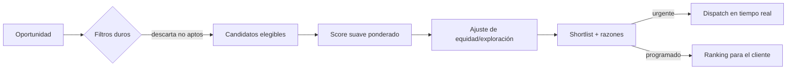
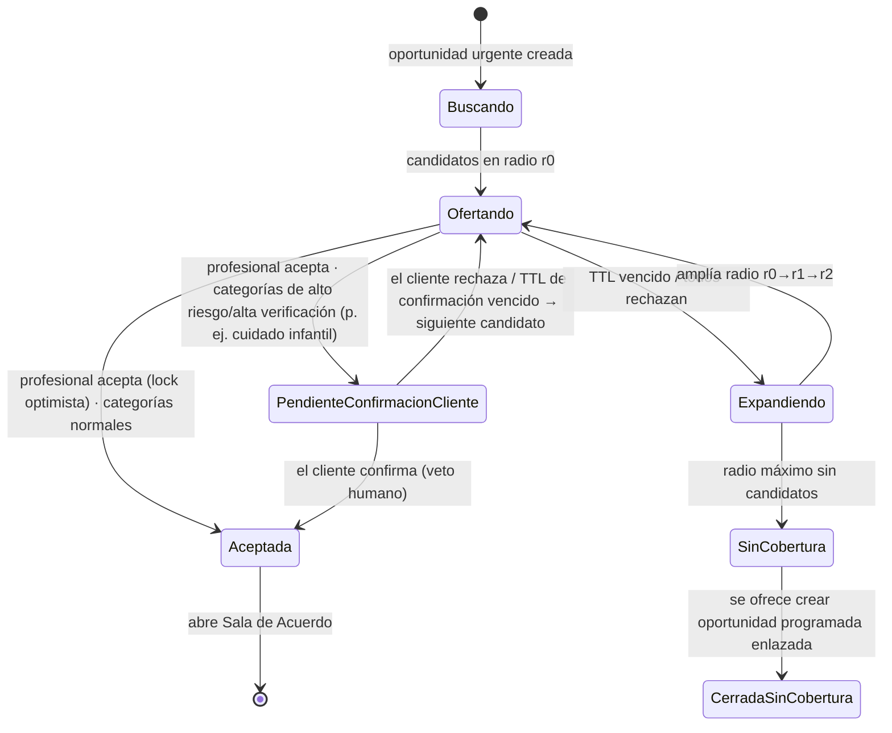

# NeatMatch™ — Diseño del Motor de Emparejamiento
### Tomo Técnico II · Deep-dive de la lógica de negocio
**Base:** Manifiesto Cap. 26 (NeatMatch), Cap. 37 (matching para empresas), Art. II (igualdad), Principio 36 ("las oportunidades deberán circular"), prompt de Erick (urgente vs. programado). Se apoya en el modelo de datos de `01-Arquitectura-NeatSpace.md`.

---

## 1. Filosofía y objetivo (qué optimiza y qué NO)

> "Nuestro objetivo no será mostrar más opciones. Será mostrar mejores opciones." (Cap. 26)

**NeatMatch optimiza la _probabilidad de un buen encuentro_**: un servicio que se completa y deja a **ambas partes satisfechas**. No optimiza clics, ni tiempo en app, ni ingresos por comisión. ⛔ Optimizar por engagement/revenue está prohibido porque erosiona la confianza (Cap. 26: "no para manipular a las personas").

**Función objetivo (para aprendizaje y evaluación):**
```
Éxito(match) = servicio_completado
             ∧ (rating_cliente ≥ 4  ∧  rating_profesional ≥ 4)
             ∧ ¬disputa
```
Todo el tuning de pesos se valida contra esta métrica, sujeta a **restricciones duras de equidad** (§6) que no se pueden violar por más que mejoren el objetivo.

---

## 2. Dos modos de operación (la distinción central)

| | 🔴 **URGENTE** (estilo Uber) | 🔵 **PROGRAMADO** (estilo inDrive) |
|---|---|---|
| Quién decide | El **sistema empuja** la oportunidad a los mejores candidatos cercanos; **el primero en aceptar gana** (dispatch general). **Excepción — categorías sensibles** (alta verificación de identidad, p. ej. cuidado infantil): la aceptación no asigna automáticamente; exige **confirmación/veto humano del cliente** antes de cerrar (§7). | El **cliente decide**: los profesionales **postulan** y NeatMatch **ordena y explica** las postulaciones. |
| Rol de NeatMatch | **Dispatcher activo** en tiempo real (WebSocket/push). | **Recomendador/ranker** asesor; el humano tiene la última palabra. |
| Peso dominante | **Proximidad + disponibilidad inmediata**. | **Idoneidad** (especialidad, Trust Score, cumplimiento) + Precio Justo. |
| Latencia | Segundos. | Minutos–horas. |
| Autonomía del cliente | Baja (velocidad prima). | **Alta** (respeta la decisión humana — Principio 1). |

> Diseñar dos modos distintos evita el error de "una sola cola para todo": la urgencia y la deliberación son problemas diferentes.

---

## 3. Entradas del modelo (y de dónde salen)

Todos los factores provienen del modelo de datos ya definido; **ninguno** es un dato sensible prohibido (§6.1).

| Factor | Fuente (entidad) | Normalización → [0,1] |
|---|---|---|
| **Proximidad** | `oportunidad.ubicacion`, `neatprofile.ubicacion_base` (PostGIS `ST_Distance`) | `f = clamp(1 − d/d_max)` |
| **Especialidad** | `perfil_habilidad`, `categoria` (match nivel 3/4) | exacto=1 · misma subcategoría=0.6 · misma principal=0.3 |
| **Trust Score** | `trust_score.valor_bayesiano` | `/100` |
| **Cumplimiento** | derivado de `servicio` (tasa completados, no-show, cancelaciones) | tasa directa |
| **Disponibilidad** | agenda/presencia (Redis para urgente; calendario para programado) | disponible=1 · parcial=0.5 · no=0 (filtro duro si 0 en urgente) |
| **Tiempo de respuesta** | mediana histórica de aceptación (`postulacion`/dispatch) | `f = clamp(1 − t/t_max)` |
| **Idioma** | `neatprofile.idiomas` vs. cliente | match=1 · no=0.2 |
| **Certificaciones** | `verificacion_identidad`, certificaciones NeatAcademy | requerida presente=1 · relevante=0.7 · ninguna=0.4 |
| **Trabajos similares** | historial `servicio` por categoría | `log(1+n)/log(1+n_ref)` (rendimientos decrecientes) |
| **Preferencias del cliente** | perfil de personalización (§5) | ajusta **pesos**, no es un factor sumado |
| **Herramientas declaradas** | `neatprofile` | tiene requeridas=1 · no=0.5 |

**"Trabajos similares" con `log`** es deliberado: evita que el veterano con 500 trabajos aplaste al de 10 por volumen bruto. Los rendimientos decrecientes + el término de equidad (§6) mantienen la cancha pareja ("las oportunidades deberán circular").

---

## 4. El scoring: filtros duros → puntaje suave → equidad

### 4.1 Pipeline



### 4.2 Filtros duros (must-pass — antes de puntuar)
1. Profesional **activo** (no suspendido/congelado, Art. IX).
2. **Capaz** en la categoría (nivel ≥ subcategoría).
3. **Serviciable geográficamente** (dentro del radio de cobertura declarado).
4. **Disponible** para el slot (ahora, en urgente; en la fecha, en programado).
5. **Verificación de identidad** ≥ nivel requerido por la categoría (categorías sensibles p. ej. niñera exigen nivel alto).
6. **Trust Score ≥ umbral mínimo** de la categoría (solo para categorías de riesgo; nunca excluye a novatos en categorías normales — ver §6.2 cold-start). Para el **ingreso** de un novato a una categoría de riesgo existe una **vía supervisada** (cupo de "oportunidades de prueba supervisadas" con verificación reforzada, §6.2) que evita el deadlock sin bajar el umbral.
7. **Sin conflicto de identidad (anti-auto-contratación / anti-Sybil):** se excluye del pool a (i) `p.usuario_id == opp.cliente_id`, y (ii) cuentas cuya identidad/dispositivo/medio de pago (**fingerprint**) esté vinculado al cliente o a cuentas previamente **suspendidas/congeladas**. Es un **bloqueo determinístico y preventivo** que aplica a **todas las categorías** (no solo las sensibles), complementando la detección estadística reactiva de doc 01 §2.3.1.

> Los filtros duros protegen la seguridad (Pilar V — Seguridad, taxonomía de Pilares Tecnológicos, doc 01 §2.2) sin sesgar por atributos personales. Un profesional nuevo **pasa** los filtros y compite por puntaje.

### 4.3 Puntaje suave
```
Score(p, o) = Σ_i  w_i(modo, categoría, preferencias) · f_i(p, o)     con  Σ w_i = 1
```

**Pesos base sugeridos por modo** (tunables por categoría; punto de partida, no dogma):

| Factor | Urgente | Programado | Empresa (Cap.37) |
|---|---:|---:|---:|
| Proximidad | **0.35** | 0.10 | 0.10 |
| Disponibilidad | **0.20** | 0.10 | 0.10 |
| Trust Score | 0.15 | **0.25** | **0.20** |
| Especialidad | 0.10 | **0.20** | **0.20** |
| Cumplimiento | 0.08 | 0.12 | **0.15** |
| Tiempo de respuesta | 0.07 | 0.05 | 0.08 |
| Trabajos similares | 0.03 | 0.08 | 0.07 |
| Certificaciones | 0.02 | 0.08 | **0.10** |
| Idioma | — | 0.02 | — |

Observa cómo el peso **se desplaza de "cerca y disponible ya" (urgente) a "idoneidad y confianza" (programado)** — exactamente lo que pide el Manifiesto ("la distancia es importante, pero la confianza también").

> **Nota sobre "Empresa" (Cap. 37):** la columna "Empresa" **no es un tercer modo operativo** del dispatcher — no tiene flujo, estado (§7), pseudocódigo (§9) ni API (§10) propios. Es una **variante paramétrica del modo Programado** para el caso B2B: los mismos pesos de Programado ajustados vía el contexto de empresa/`client_prefs`. Su despacho **sigue íntegramente el flujo Programado** (postulaciones + ranking asesor). Los dos modos operativos siguen siendo exactamente **dos** (§2).

### 4.4 Ajuste de equidad / exploración (Art. II + Principio 36)
> **Fase:** los **filtros duros + score ponderado simple + fallback de radio** son **MVP/V1**. El **boost de exploración con β tuneable**, la **reserva de cupos** y el **tope anti-monopolio** de este bloque son **V2+** (requieren la entidad `match_impression`, dueño y proceso de gobernanza).

El puntaje puro tiende a la "regla del rico se hace más rico". Se corrige con dos mecanismos:

- **Boost de visibilidad para talento con poca exposición:**
  ```
  ScoreFinal = Score · (1 + β · exploración(p))
  exploración(p) = 1 / (1 + impresiones_recientes(p))   // decae con la exposición
  ```
  β pequeño (p. ej. 0.15). Un profesional nuevo y capaz que aún no ha sido mostrado recibe un empujón acotado — suficiente para conseguir su primera oportunidad, insuficiente para desplazar la calidad.

  **Definición precisa de `impresiones_recientes(p)`** (para que el boost sea implementable, auditable y no manipulable):
  - **(a) Fuente de datos server-side:** contador incrementado **únicamente** cuando el propio pipeline de NeatMatch incluye al profesional en una **shortlist real** (dispatch u ordenamiento entregado). **No** cuenta vistas de perfil ni otros eventos client-facing, de modo que un tercero no pueda inflar impresiones para denegar el boost a un rival.
  - **(b) Ventana temporal explícita:** solo se consideran las impresiones de los **últimos 14 días** (ventana deslizante).
  - **(c) Ámbito explícito:** el conteo es **por categoría y zona**, no global — la falta de exposición se mide donde el profesional efectivamente compite.
  - **(d) Entidad persistida (doc 01):** requiere una entidad `match_impression(profesional_id, oportunidad_id, categoria_id, zona, mostrado_en)` que alimente tanto el boost en tiempo real como el cálculo batch del Gini (§6.4/§12), garantizando una sola fuente de verdad.
  - **(e) Monitoreo de anomalías:** picos súbitos de impresiones (§6.4) se detectan y alertan como posible gaming del mecanismo.
- **Reserva de cupos en la shortlist (solo Programado/Empresa):** de N candidatos mostrados/ofertados, se reservan **K** (p. ej. 2 de 8) para **"talento emergente que supera el umbral de calidad"**. Garantiza impresiones al novato sin bajar el estándar. **En URGENTE se omite esta reserva** (`reserved_for_emerging=0`): el boost de exploración sí modula el **orden** del ranking, pero no se fuerzan slots a perfiles no óptimos, para no retrasar la cobertura real en una emergencia (§2: en urgente "la velocidad prima").
- **Tope anti-monopolio:** se limita cuántas veces el **mismo** profesional encabeza resultados de una categoría/zona en una ventana temporal ("las oportunidades deberán circular", Principio 36).

> Este bloque es lo que convierte a NeatMatch en un motor de **oportunidades** y no solo de eficiencia. Es la traducción algorítmica del **Pilar I — Oportunidades (Cinco Pilares del ADN)** y del Art. II (igualdad). _(Nota de trazabilidad: "Pilar I" aquí es el de la taxonomía de los Cinco Pilares del ADN; no debe confundirse con el "Pilar I — Aplicaciones" de la taxonomía de Pilares Tecnológicos, doc 01 §2.2.)_

---

## 5. Personalización responsable (Cap. 26)

El cliente puede inclinar la balanza sin romper calidad/seguridad. Se implementa como **perfiles de preferencia que reponderan `w_i`**, no como factores nuevos:

| Preferencia del cliente | Efecto |
|---|---|
| "Rapidez" | ↑ proximidad, ↑ disponibilidad, ↑ tiempo de respuesta |
| "Experiencia" | ↑ trabajos similares, ↑ cumplimiento |
| "Precio" | integra Precio Justo (postulaciones más económicas suben, con la justificación visible) — **con tope explícito** al desplazamiento de peso que puede inducir (análogo al β acotado del boost, §4.4), y **piso garantizado** para Trust Score y Cumplimiento |
| "Certificado" | ↑ certificaciones, ↑ Trust Score |

**Barrera ética:** la personalización nunca puede reponderar hacia atributos prohibidos, ni bajar los filtros duros de seguridad. "La personalización nunca deberá convertirse en discriminación" (Cap. 26). Además, la preferencia **"Precio" está acotada**: su desplazamiento de peso tiene un **tope máximo** (análogo al β ≤ 0.15 del boost, §4.4) y **no puede reducir por debajo de un mínimo garantizado los pesos de Trust Score y Cumplimiento**. Así se evita empujar la competencia a la baja ("no debería depender solo de quién cobra menos", Cap. 26) y se protege el trabajo digno (Art. I).

---

## 6. Anti-sesgo y equidad (requisito no negociable)

### 6.1 Atributos PROHIBIDOS como entrada ⛔ (Art. II)
NeatMatch **nunca** usa, directa o indirectamente (proxies):
- Origen · condición económica · edad · género · religión · nacionalidad · nivel de estudios formales · apariencia/foto.

Consecuencia técnica: estas columnas **no existen en el vector de features** del modelo, y se corre un **test de proxy** (¿algún feature permitido predice un atributo prohibido con alta correlación? → se audita). "Experiencia previa externa" tampoco filtra (Art. II: la reputación se construye **dentro** de la plataforma).

### 6.2 Cold-start justo (el novato no arranca en cero)
Gracias a la **media bayesiana** del Trust Score (doc 01, §2.3.1), un profesional sin historial arranca cerca de la media global `m`, no en 0. Sumado al boost de exploración (§4.4), consigue impresiones reales. **KPI clave: "tiempo hasta la primera oportunidad" de un profesional nuevo.**

**Entrada en categorías de riesgo (deadlock del filtro #6):** la media bayesiana resuelve el arranque **solo en categorías normales**. En categorías de riesgo, el Trust Score solo crece con trabajos que exigen pasar ese mismo umbral, creando un **deadlock** para el novato. Se resuelve con una **vía de entrada supervisada explícita** — un **cupo limitado de "oportunidades de prueba supervisadas"** con **verificación de identidad reforzada** — en lugar de bajar el umbral. **No se reduce el umbral automáticamente**; la ruta supervisada es el mecanismo documentado de primera entrada (coherente con la confirmación humana del cliente en categorías sensibles, §7).

### 6.3 Explicabilidad (Cap. 26)
Cada resultado incluye **reason codes** legibles (jamás referidos a atributos prohibidos):
```
match_reasons: [
  { code: "PROXIMITY",   text: "A menos de 2 km de tu dirección" },  // distancia agrupada en rangos ("menos de 2 km" / tramos de 1 km), nunca decimales exactos → evita triangular la ubicación base del profesional
  { code: "TRUST",       text: "Trust Score 92/100 en Gasfitería" },
  { code: "SPECIALTY",   text: "Especialista en reparación de tableros" },
  { code: "AVAILABILITY", text: "Disponible ahora" },
  { code: "EMERGING",    text: "Nuevo talento verificado" }   // transparencia del boost
]
```
Mostrar el motivo **también construye confianza** (Cap. 26) y hace el sistema auditable.

### 6.4 Auditoría periódica (Cap. 26 "será revisado periódicamente")
> **Fase:** el **panel de Gini**, el monitoreo de anomalías de impresiones y la revisión de pesos por el **Comité del Propósito** son **V2+** (gobernanza avanzada). El MVP/V1 registra los datos base (`match_impression`, ratings) que estas métricas consumirán después.

Métricas de equidad monitoreadas continuamente:
- **Gini de distribución de oportunidades** por profesional (¿se concentran en pocos?).
- **Ratio de exposición** nuevos vs. consolidados.
- **Paridad de tasa de éxito** entre segmentos.
- **Anomalías de impresiones** (`match_impression`): picos súbitos por profesional/categoría/zona → alerta de posible gaming del boost de exploración.
- Cambios de peso → revisados por el **Comité del Propósito** (Cap. 70) antes de producción; nunca auto-desplegados por el optimizador.

---

## 7. Dispatch de URGENTES — máquina de estados (tiempo real)



**Reglas del dispatcher:**
- Oferta a **top-N por tandas** (no a todos a la vez → evita el "thundering herd" y el spam al profesional).
- **TTL por oferta** (p. ej. 30–60 s). Sin respuesta = declinada implícita → siguiente tanda.
- **Lock optimista** al aceptar: el primero gana; el resto recibe "oportunidad ya tomada" (sin penalización).
- **Confirmación humana en categorías sensibles:** en categorías de alto riesgo/alta verificación de identidad (p. ej. cuidado infantil/niñera), la aceptación del profesional **no asigna automáticamente**: la oportunidad pasa a **PendienteConfirmacionCliente** y requiere la **confirmación humana (veto) del cliente** antes de llegar a **Aceptada** (Ppio 1: "las personas por encima de la tecnología"; Ppio 15: toda decisión importante debe poder explicarse).
- **Expansión de radio** progresiva si nadie acepta.
- **Anti-abuso:** aceptar y luego cancelar penaliza el factor **cumplimiento** (evita gamear el tiempo de respuesta). Cap. concurrente de ofertas por profesional para no saturarlo.
- **Privacidad por diseño (doc 01 §2.3.2, "mínimo dato necesario"):** el payload de `urgent_offer` enviado a los profesionales en tanda incluye **solo geo aproximada/zona y categoría** — nunca la dirección ni la geo exacta del cliente. La **dirección/geo exacta se revela recién al abrir la Sala de Acuerdo** (post lock optimista, tras la aceptación), de modo que múltiples profesionales que nunca toman el trabajo no vean la dirección del cliente.
- **Fallback:** sin cobertura → se ofrece al cliente **crear una nueva oportunidad programada enlazada** (FK `convertida_desde_id`, postulaciones) mientras la urgente original pasa a estado **cerrada/sin_cobertura**; `oportunidad.tipo` **permanece inmutable** (doc 01 §1.2) — no hay UPDATE de tipo, sino una entidad nueva vinculada. No se deja al cliente en el vacío.

---

## 8. Aprendizaje continuo (con barandas)

> **Fase:** toda esta sección es **V2+**. El **aprendizaje/ajuste automático de pesos con evaluación contrafactual** no forma parte del MVP/V1, que usa **pesos fijos** (§4.3) ajustados manualmente. No sobre-invertir aquí antes de validar la hipótesis central (matching básico conecta clientes con profesionales).

> "Aprenderá... no para manipular a las personas, sino para comprender qué combinaciones producen mayor satisfacción." (Cap. 26)

- **Señales de aprendizaje:** aceptación de ofertas, finalización, ratings bidireccionales, disputas, satisfacción post-match.
- **Qué aprende:** los **pesos `w_i` por categoría/zona** (offline, evaluación contrafactual), no una caja negra opaca.
- **Barandas:**
  1. Objetivo = éxito del match (§1), **nunca** engagement/revenue. ⛔
  2. Restricciones de equidad (§6) son **duras**: un cambio que mejora el objetivo pero empeora el Gini se rechaza.
  3. Cambios de peso pasan por revisión humana (Comité del Propósito).
  4. Modelo **explicable por diseño** (pesos legibles) — se evita, en el MVP, un ranker de caja negra que no se pueda auditar (Principio 15: "toda decisión importante deberá poder explicarse").

---

## 9. Pseudocódigo de referencia

```python
def neatmatch(opp, mode, client_prefs):
    # 1. Filtros duros
    candidates = query_professionals(
        capable_in=opp.category,
        serviceable_at=opp.location,
        available_for=opp.slot(mode),
        active=True,
        min_identity=opp.category.required_identity_level,
        min_trust=opp.category.min_trust_if_sensitive,
        exclude_conflicted=identity_conflict_set(opp.cliente_id),  # self-contracting + fingerprint de cuentas ligadas/suspendidas (todas las categorías)
    )
    if not candidates:
        return fallback(opp, mode)   # urgente → ampliar radio → crear opp programada enlazada (convertida_desde_id); tipo inmutable

    # 2. Puntaje suave
    weights = tuned_weights(mode, opp.category, client_prefs)
    scored = []
    for p in candidates:
        f = feature_vector(p, opp)              # sólo features permitidos
        base = dot(weights, f)
        equity = 1 + BETA / (1 + recent_impressions(p))
        scored.append((p, base * equity, reason_codes(f, p)))

    # 3. Shortlist con reserva de equidad + tope anti-monopolio
    #    El boost de exploración ya afectó el ORDEN (arriba, en `equity`) en todos los modos.
    #    La RESERVA de cupos (fuerza perfiles no óptimos en la 1.ª tanda) solo aplica fuera de urgente:
    #    en emergencias la cobertura real no debe retrasarse por una meta de exposición (§2, §4.4).
    ranked = rank(scored)
    reserved = 0 if mode == "urgente" else 2
    shortlist = pick_with_fairness(ranked, N=8, reserved_for_emerging=reserved,
                                   monopoly_cap=True)

    # 4. Salida según modo
    if mode == "urgente":
        return dispatch_realtime(opp, shortlist, ttl=45, radius_steps=[3,6,12])
    else:
        return advisory_ranking(opp, shortlist)  # el cliente elige
```

---

## 10. API y eventos

```
GET  /v1/opportunities/{id}/matches?prefs=speed        # programado: ranking + reason_codes
#   AUTORIZACIÓN (obligatoria): solo `oportunidad.cliente_id == requester`
#     (o miembro de empresa con el RBAC correspondiente para oportunidades B2B) puede invocar /matches.
#   RATE-LIMITING por usuario/oportunidad para impedir scraping.
#   NUNCA se expone el Trust Score numérico crudo junto al flag "EMERGING" a quien no sea
#     el cliente legítimo → evita IDOR, inteligencia competitiva y hostigamiento a novatos (§4.4/§6.2).
# Urgente: no hay GET; el dispatcher empuja por WebSocket
WS   evento "urgent_offer"   → {opportunity (geo aproximada/zona + categoría, SIN dirección exacta), expires_at, reason_codes}
                               # geo/dirección exacta se revela solo en la Sala de Acuerdo, tras aceptación
WS   acción "accept_offer"   → 200 (ganador) | 409 (ya tomada)
```
Eventos de dominio consumidos: `OportunidadCreada`, `ProfesionalDisponibleCambio`, `ServicioFinalizado` (actualiza señales de aprendizaje).

---

## 11. Casos borde y anti-gaming

> **Fase:** el bloqueo determinístico de conflicto de identidad (filtro #7), la expansión de radio y el fallback son **MVP/V1**. La **detección estadística de anillos de colusión** y el **tope anti-monopolio** son **V2+**.

| Situación | Manejo |
|---|---|
| Sin candidatos en radio | Expandir radio → si sigue sin cobertura, la urgente se cierra (cerrada/sin_cobertura) y se ofrece **crear una oportunidad programada enlazada** (`convertida_desde_id`); `oportunidad.tipo` permanece inmutable. |
| Doble fallo de cobertura (programado tampoco recibe postulaciones) | Si tras crear la oportunidad programada enlazada no llega ninguna postulación (zona/categoría sin oferta): se ofrece al cliente **lista de espera** con notificación al reactivarse la oferta, opción de **ampliar categoría/radio**, y **contacto con soporte**; nunca se deja al cliente sin ninguna acción visible. |
| Empate en score | Desempata por **mayor equidad** (menos impresiones recientes). |
| Profesional acepta y cancela | Penaliza **cumplimiento**; reduce prioridad futura. |
| Auto-contratación / anillo de colusión | **Bloqueo determinístico en matching** (filtro duro #7): se excluye del pool a `cliente_id` y a cuentas ligadas por fingerprint/identidad/medio de pago o previamente suspendidas — en todas las categorías. Además, detección estadística (doc 01 §2.3.1) + revisión humana. |
| Sobre-saturación de un top-pro | Tope anti-monopolio reparte oportunidades. |
| Cliente pide atributo prohibido ("solo jóvenes") | Bloqueado por diseño; no existe el filtro. ⛔ |

---

## 12. KPIs de salud (lo que vigila el Panel del Fundador, Cap. 50)

- ⏱️ **Tiempo hasta la 1.ª oportunidad** de un profesional nuevo (objetivo: bajo).
- 📈 **Tasa de éxito del match** (completado + ambos satisfechos).
- ⚖️ **Gini de oportunidades** (objetivo: bajo = mejor circulación).
- 🔄 **Ratio de exposición** nuevos/consolidados.
- ✅ **Tasa de aceptación** de ofertas urgentes y tiempo medio de cobertura.
- 🚫 **Tasa de disputa** por match (objetivo: baja).

> El primer indicador que el Fundador quiere ver cada mañana no es cuánto se ganó, sino **cuántas oportunidades se crearon** (Cap. 50). El Gini y el "tiempo a la primera oportunidad" son la métrica de que NeatMatch cumple el propósito.

---

### Validación contra las restricciones de negocio
| Decisión de NeatMatch | Oportunidades | Confianza | Ética | Largo plazo |
|---|---|---|---|---|
| Doble modo urgente/programado | ✅ | ✅ | ✅ autonomía del cliente | ✅ |
| Boost de exploración + cupos reservados | ✅✅ | ✅ | ✅✅ igualdad (Art. II) | ✅ |
| Atributos prohibidos fuera del modelo | ✅ | ✅ | ✅✅ | ✅ |
| Explicabilidad por reason codes | ✅ | ✅✅ | ✅ | ✅ |
| Aprender éxito-del-match, no engagement | ✅ | ✅✅ | ✅✅ | ✅✅ |
| Pesos legibles + revisión del Comité | ➖ | ✅ | ✅ | ✅✅ |
