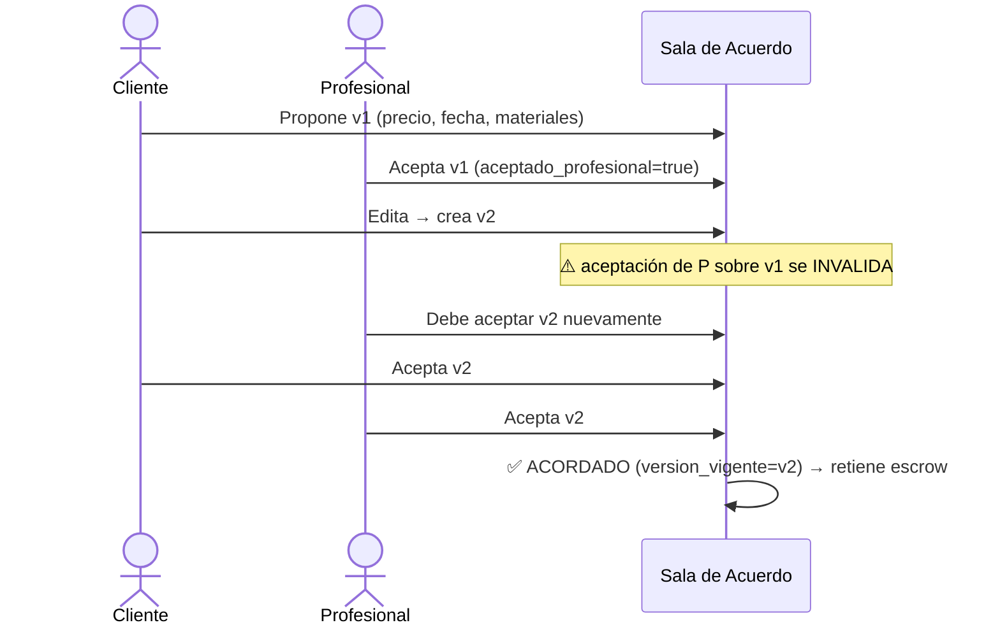
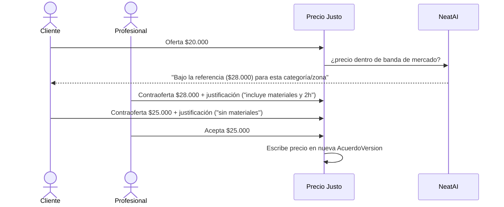

# Sala de Acuerdo™ — Ciclo de Vida y Reglas de Negocio
### Tomo Técnico III · Deep-dive del sistema de negociación
**Base:** Manifiesto Cap. 23 (Sala de Acuerdo), Precio Justo (Cap. 23/Economía + prompt de Erick), Biblia cap. 9 (Comunicación) y cap. 17 (Conflictos). Se apoya en el modelo de datos de `01-Arquitectura-NeatSpace.md` (entidades `acuerdo`, `acuerdo_version`, `precio_justo_oferta`, `servicio`, `pago`).

---

## 1. Propósito y principio de diseño

> "No será solamente un chat. Será el lugar donde se construye la confianza antes de comenzar un trabajo." (Cap. 23)

La Sala de Acuerdo convierte una conversación informal en un **contrato versionado, inmutable y aceptado por ambas partes** antes de mover un peso. Su regla madre:

> ⚖️ **Ningún trabajo comienza —y ningún dinero se mueve— sin un acuerdo mutuamente aceptado y con los fondos retenidos en escrow.**

Esto materializa la doble protección del Cap. 23: el cliente puede demostrar **qué pidió**, el profesional puede demostrar **qué se comprometió a hacer**, y ambos operan tranquilos.

Es, además, la **brecha crítica de los mockups**: hoy se salta de "Detalle" directo a "Pagar con MercadoPago", sin el eslabón donde se construye la confianza.

---

## 2. Qué se negocia (campos del acuerdo)

Según Cap. 23, un `AcuerdoVersion` captura como **snapshot inmutable**:

| Campo | Obligatorio para aceptar | Notas |
|---|---|---|
| Precio final | ✅ siempre | Resultado de Precio Justo (§5). Exigido en urgente y programado. |
| Fecha del servicio | ✅ (programado) | En urgente = "ahora". |
| Horario | ✅ (programado) | |
| Dirección | ✅ siempre | **Divulgación progresiva:** durante `ABIERTA`/`NEGOCIANDO`/`PROPUESTA` se muestra solo **zona/comuna aproximada o radio**; la **dirección exacta con geo** (para NeatMatch/ruta) se revela **recién al pasar a `ACORDADO`** (con escrow retenido). La revelación queda registrada como evento en el historial inmutable (§10). |
| Duración estimada | ✅ siempre | Base para agenda y disputas. |
| Materiales incluidos / excluidos | ✅ (programado) | Fuente típica de conflicto → obligatorio en programado; puede omitirse en urgente (§9). |
| Responsabilidades de cada parte | ✅ (programado) | Alcance explícito. |
| Condiciones especiales | ➖ | Mascotas, acceso, estacionamiento, etc. |
| Fotografías del estado inicial | ➖ (recomendado) | Evidencia para disputas. |
| Observaciones adicionales | ➖ | |

> Los campos obligatorios los verifica el **check de completitud de NeatAI** (§7): no se puede aceptar un acuerdo con vacíos que después generen discusión.
>
> **Aplicabilidad por modo (ver §9):** precio, dirección y duración son exigidos **siempre**; materiales, responsabilidades y condiciones especiales pueden **relajarse en modo urgente**. R4 evalúa el conjunto obligatorio correspondiente al modo activo.
>
> **Por qué la dirección es progresiva:** la dirección exacta es un dato sensible de riesgo físico (seguridad del hogar). Como el compromiso real recién ocurre en `ACORDADO`, aplica el principio de **mínima exposición**: exhibirla antes permitiría abrir negociaciones solo para obtener domicilios (*casing*) sin más rastro que una negociación abandonada.

---

## 3. Máquina de estados del ciclo de vida

```mermaid
stateDiagram-v2
    [*] --> ABIERTA: se crea la sala (términos base de la oportunidad)
    ABIERTA --> NEGOCIANDO: alguien edita términos / lanza Precio Justo
    NEGOCIANDO --> PROPUESTA: se presenta una versión concreta
    PROPUESTA --> NEGOCIANDO: la otra parte edita (acepta se resetea)
    PROPUESTA --> ACORDADO: ✅ ambos aceptan la MISMA versión **y** la retención de escrow confirma OK
    PROPUESTA --> PAGO_FALLIDO: doble aceptación, pero la retención de escrow falla
    PAGO_FALLIDO --> PROPUESTA: reintento (otros fondos / medio); NO fija version_vigente como definitiva
    ACORDADO --> EN_EJECUCION: profesional inicia el servicio
    EN_EJECUCION --> ENMIENDA: cambio durante el trabajo
    ENMIENDA --> EN_EJECUCION: ✅ ambos aceptan nueva versión + ajuste escrow
    EN_EJECUCION --> ENTREGADO: profesional marca "trabajo entregado"
    ENTREGADO --> CERRADO: cliente confirma OK → libera escrow (comisión 20%)
    ENTREGADO --> CERRADO: vence ventana de reclamo (24–48h) sin disputa → libera escrow
    CERRADO --> [*]: habilita evaluación (Trust Score)

    NEGOCIANDO --> EXPIRADO: TTL sin acuerdo
    PROPUESTA --> EXPIRADO: TTL sin doble aceptación
    ABIERTA --> CANCELADO: cancelación antes de acordar (sin costo)
    ACORDADO --> CANCELADO: según política de cancelación
    EN_EJECUCION --> EN_DISPUTA: se abre conflicto → congela escrow
    ENTREGADO --> EN_DISPUTA: cliente abre reclamo dentro de la ventana
    ENMIENDA --> EN_DISPUTA
    EN_DISPUTA --> CERRADO: resolución a favor del profesional (libera con comisión 20%)
    EN_DISPUTA --> CANCELADO: resolución a favor del cliente (reembolso total/parcial, sin comisión o proporcional)
```



**Estados clave:**
- **PROPUESTA vs ACORDADO:** una versión está "sobre la mesa" hasta que **ambos** la aceptan. `ACORDADO` **solo se alcanza si la retención de escrow confirma OK**; recién ahí `version_vigente` queda definitiva. Si la doble aceptación ocurre pero la retención falla (fondos insuficientes / rechazo MercadoPago / timeout), la sala pasa a `PAGO_FALLIDO` y **no** queda ACORDADO (coherente con la regla madre del §1: sin fondos retenidos no hay acuerdo). Desde `PAGO_FALLIDO` se puede reintentar sin fijar `version_vigente` como definitiva.
- **ENTREGADO (liberación con validación):** el profesional **no** cierra ni cobra unilateralmente. Marca *"trabajo entregado"* → la sala pasa a `ENTREGADO`, y la **liberación real del escrow** requiere la **confirmación del cliente** *o* el **vencimiento de una ventana de reclamo (24–48h)** sin disputa abierta. Esta simetría espeja la doble aceptación de `ACORDADO` en el punto de mayor exposición económica: el cliente valida la entrega antes de que el dinero cambie de manos.
- **ENMIENDA:** los cambios a mitad de trabajo (problema adicional, más tiempo, más materiales — Cap. 23) **no se hacen de palabra**: crean una nueva versión que debe re-aceptarse antes de continuar. El cliente puede **rechazar** una enmienda y **cerrar el trabajo hasta ese punto sin penalidad**, pagando solo lo ya acordado (salvaguarda anti *scope creep*, ver §6 R3).
- **EN_DISPUTA:** congela los fondos y entrega el caso al Sistema de Resolución de Conflictos con todo el historial inmutable como evidencia. El desenlace depende del resultado: `resolucion ∈ {pagado, reembolsado, dividido}`. **A favor del profesional** → `CERRADO` liberando con comisión 20%. **A favor del cliente** → `CANCELADO` con reembolso total o parcial, **sin comisión o proporcional** al monto efectivamente liberado (nunca se cobra 20% sobre un reembolso; ver §6 R10).

---

## 4. Versionado inmutable y doble aceptación (el corazón anti-conflicto)

### 4.1 Cómo funciona
- Cada modificación de términos crea un **nuevo `AcuerdoVersion` (N+1)**, snapshot completo e inmutable. Nunca se edita una versión existente.
- `acuerdo.version_vigente` = **última versión aceptada por ambas partes**.
- Aceptar es explícito, por parte: `aceptado_cliente` + `aceptado_profesional`, cada uno con **timestamp e identidad** (no repudio).
- **Step-up de identidad:** no basta la sesión activa del dispositivo. `POST /accept` exige una **confirmación de step-up (PIN, biometría o equivalente)**, obligatoria **especialmente para montos sobre un umbral**, para que un tercero con el dispositivo desbloqueado no pueda aceptar y disparar el escrow. El **método de verificación usado** se registra en el evento `AcuerdoAceptado` (§10), no solo el timestamp.

### 4.2 Regla de oro anti-conflicto ⛔
> **Si una parte edita después de que la otra aceptó, TODAS las aceptaciones previas se invalidan y ambas deben re-aceptar la nueva versión.**

Esto elimina el fraude clásico "acepto una cosa y te cambio la letra chica": es **técnicamente imposible** quedar comprometido a términos que no aceptaste explícitamente. La evidencia es la cadena de versiones + aceptaciones con timestamp.



---

## 5. Precio Justo™ — negociación con justificación (estilo inDrive)

### 5.1 Flujo
- Cualquiera de las partes puede lanzar una **contraoferta** cuando considere que el precio no es acorde al mercado.
- **La justificación es obligatoria** ⛔ (`justificacion` NOT NULL). No hay contraoferta muda: "reenviar una contra oferta justificando el por qué de su precio" (prompt de Erick).
- Cadena de ofertas: `propuesta → contraoferta → contra-contraoferta → …`, cada una con su justificación, todas registradas.
- Al **aceptar** una oferta, su `monto` se escribe en una **nueva `AcuerdoVersion`** (que igualmente requiere doble aceptación del acuerdo completo).



### 5.2 Barandas
- **Banda de mercado** por categoría/zona (derivada de servicios históricos + `precio_referencia`). NeatAI **advierte** si el precio se aleja mucho, pero **no bloquea** — la decisión es humana (Cap. 23: la IA no decide).
- Precios absurdos (0, negativos, órdenes de magnitud fuera) → validación dura.
- Toda la cadena de Precio Justo es **patrimonio** (evidencia en disputas).

---

## 6. Reglas de negocio para evitar conflictos (checklist no negociable)

| # | Regla | Por qué (Manifiesto) |
|---|---|---|
| R1 | Doble aceptación sobre la **misma** versión; editar invalida aceptaciones. | Protección de ambas partes (Cap. 23). |
| R2 | El trabajo **no inicia** hasta `ACORDADO` **y** escrow retenido. | "El profesional acepta sabiendo que recibirá su pago" (Cap. 74). |
| R3 | Cambios a mitad de trabajo **solo** vía `ENMIENDA` (nueva versión + re-aceptación + ajuste escrow). **Anti *scope creep*:** el cliente puede **rechazar** la enmienda y **cerrar el trabajo hasta ese punto sin penalidad**, pagando solo lo ya acordado. Superado un **umbral** (p.ej. % del precio original), la enmienda exige **evidencia adicional obligatoria** (foto del hallazgo que la justifica) y/o **alerta de riesgo de NeatAI** (§7). | "Actualizar el acuerdo antes de continuar… evitaremos discusiones posteriores" (Cap. 23); costo hundido no debe volverse extorsión (Cap. 23). |
| R4 | Campos obligatorios (§2) completos antes de permitir aceptar. **El conjunto obligatorio depende del modo** (§2/§9): precio/dirección/duración siempre; materiales/condiciones pueden relajarse en urgente. | Claridad reduce conflictos (Cap. 23). |
| R5 | Aceptación explícita, con identidad + timestamp (no repudio) y **step-up** (§4.1). | No repudio / "ambos operan tranquilos" (Cap. 23); Identidad Verificada (Cap. 74 Pilar I). |
| R6 | Justificación obligatoria en toda contraoferta. **En urgente**, la justificación de Precio Justo se satisface con **chips predefinidos** (lista corta, sin tipeo libre) que cumplen el NOT NULL; alternativamente Precio Justo opera como **referencia rápida** sin contraoferta plena (ver §9). | Precio Justo (prompt Erick). |
| R7 | Historial (términos + chat) inmutable y ligado al servicio. | Evidencia en conflictos (Biblia cap. 9/17). |
| R8 | TTL de expiración en `NEGOCIANDO`/`PROPUESTA`; la oportunidad puede reabrirse. **El TTL difiere por modo y es un parámetro de configuración versionado**, no una constante implícita: **urgente** = pocos minutos sin doble aceptación → `EXPIRADO`; **programado** = 24–48h configurable por categoría (ver §12). | Evita acuerdos zombis. |
| R9 | Política de cancelación según estado (antes de `ACORDADO` = sin costo; después = política). | Justicia proporcional (Cap. 74 Pilar IV). |
| R10 | `EN_DISPUTA` **congela** el escrow hasta resolución, **con plazo máximo** (X días hábiles) y reglas de *default* si se excede (liberación parcial / arbitraje escalonado). La **comisión depende del resultado**: a favor del profesional = 20% sobre lo liberado; a favor del cliente = **sin comisión**; **resolución `dividida` = comisión proporcional** al monto efectivamente liberado al profesional (nunca sobre el monto reembolsado). | Protección de la comunidad (Biblia cap. 17); proporcionalidad (Cap. 74 Pilar IV). |

---

## 7. NeatAI como mediadora (asiste, no decide — Cap. 23)

| Capacidad | Qué hace | Límite |
|---|---|---|
| **Detección de vaguedad** | Marca condiciones poco claras ("limpieza profunda" sin definir alcance). | No reescribe sin consentimiento. |
| **Check de completitud** | Verifica campos obligatorios y sugiere los olvidados (acceso, estacionamiento, mascotas, materiales). | No completa por el usuario. |
| **Sugerencia de preguntas** | "¿Incluye retiro de escombros?", "¿Hay estacionamiento?". | |
| **Alerta de riesgo** | Advierte si el acuerdo puede generar problemas (precio fuera de banda, alcance ambiguo). | Solo advierte. |
| **Detección de contacto externo** | Detecta patrones de fuga fuera de la plataforma en el chat inline (números telefónicos, handles, *"hablemos por WhatsApp"*), alerta educativamente a **ambas partes** sobre la pérdida de protección de escrow / Trust Score si el trabajo se cierra por fuera, y registra la señal para el *scoring* de riesgo del par. | Solo advierte, **no bloquea**. |
| **Resumen en lenguaje claro** | Antes de aceptar: *"Vas a aceptar: aseo profundo de 2 ambientes, monto bruto $25.000 · comisión 20% + comisiones MercadoPago $X · **neto a recibir $Y**, lunes 10:00, materiales por cuenta del profesional."* Muestra **monto bruto, comisión (20% + eventuales comisiones de MercadoPago) y neto a recibir** siempre antes de la aceptación. | El usuario confirma. |

> Ninguna de estas acciones **acepta, cambia o decide** por las personas. "La inteligencia artificial no tomará decisiones. Ayudará a que las personas tomen mejores decisiones." (Cap. 23)

> **Resumen mínimo también en urgente:** incluso en modo urgente (§9), **antes del segundo tap** se renderiza un resumen mínimo de **1 línea** (precio final + dirección/hora), cumpliendo la Regla de los 3 segundos. El doble-tap captura **identidad + timestamp** con el mismo rigor de no-repudio que exige R5, **sin excepción**: se compromete dinero real vía escrow, y un doble-tap accidental no debe comprometer términos no revisados.

---

## 8. Integración con el ecosistema (Cap. 23)

```mermaid
flowchart LR
    SALA[Sala de Acuerdo]
    SALA -->|lee| NP[NeatProfile / Trust Score<br/>de la contraparte]
    SALA -->|usa| PJ[Precio Justo]
    SALA -->|al ACORDAR: retiene (si falla → PAGO_FALLIDO)| W[NeatWallet · escrow]
    W -->|al CERRAR: libera según resultado de la resolución| PRO[Profesional]
    SALA -->|si conflicto| CONF[Resolución de Conflictos]
    SALA -->|historial inmutable| CONF
    SALA -->|habilita al CERRAR| REP[Evaluación → Trust Score]
```

- **NeatProfile / Trust Score**: visibles en el encabezado de la sala — sabes con quién tratas *antes* de comprometerte.
- **NeatWallet**: `ACORDADO` → retención (escrow). **La retención puede fallar** (fondos insuficientes / rechazo MercadoPago / timeout); en ese caso el acuerdo **no queda `ACORDADO`** (pasa a `PAGO_FALLIDO`, ver §3). `ENTREGADO` + confirmación del cliente o vencimiento de la ventana de reclamo → `CERRADO` con liberación y comisión 20%; `ENMIENDA` con mayor precio → retención adicional; `CANCELADO/DISPUTA` → según política/resolución (la liberación **depende del resultado**: no siempre paga 80% al profesional).
- **Conflictos**: el historial completo (versiones + Precio Justo + chat) es la evidencia de las 8 etapas (Biblia cap. 17).
- **Reputación**: solo al `CERRAR` (servicio pagado) se habilita la evaluación (coherente con doc 01 §2.3.1: no hay reseña sin transacción real).

---

## 9. Diferencia por modo (urgente vs programado)

| | Urgente | Programado |
|---|---|---|
| Sala | **Ligera y rápida**: términos base pre-cargados, campos mínimos, doble-tap para aceptar (Regla del mínimo esfuerzo, Cap. 44). | **Completa**: negociación de todos los campos + Precio Justo. |
| Campos obligatorios (R4) | Solo **precio, dirección y duración**; materiales/responsabilidades/condiciones pueden omitirse. | **Todos** los de §2. |
| Precio | Referencia rápida; contraoferta breve. Justificación de Precio Justo vía **chips predefinidos** (sin tipeo libre) que satisfacen R6, o Precio Justo como **referencia rápida** sin contraoferta plena. | Contraoferta plena con justificaciones (R6 con tipeo libre). |
| Fecha/hora | "Ahora". | Se negocia. |
| Resumen + no-repudio | **Antes del segundo tap**, resumen mínimo de 1 línea (precio final + dirección/hora; Regla de los 3 segundos). El **doble-tap captura identidad + timestamp con el mismo rigor de R5, sin excepción**. | Resumen pre-aceptación completo (§7). |
| TTL (R8) | **Pocos minutos** sin doble aceptación → `EXPIRADO`. | **24–48h** configurable por categoría. |
| Objetivo UX | Cerrar en < 60 s. | Claridad total antes de agendar. |

---

## 10. API y eventos

```
POST /v1/opportunities/{id}/agreement          # abre la sala (estado ABIERTA)
GET  /v1/agreements/{id}                        # estado, version_vigente, partes, Trust Scores
POST /v1/agreements/{id}/versions               # propone nueva versión de términos → PROPUESTA
POST /v1/agreements/{id}/price-offers           # {monto, justificacion*}  (422 si falta justificación)
POST /v1/agreements/{id}/price-offers/{oid}/accept
POST /v1/agreements/{id}/accept                 # acepta la versión vigente por tu parte
      # requiere step-up (PIN/biometría) — obligatorio sobre umbral de monto
      # 409 CONFLICT si la versión cambió desde que la viste (optimistic lock)
POST /v1/agreements/{id}/amendments             # enmienda durante EN_EJECUCION
POST /v1/agreements/{id}/deliver                # profesional marca "trabajo entregado" → ENTREGADO (abre ventana de reclamo)
POST /v1/agreements/{id}/confirm                # cliente confirma entrega → CERRADO + libera escrow
      # o liberación automática al vencer la ventana de reclamo (24–48h) sin disputa
POST /v1/agreements/{id}/cancel                 # según política de estado
```

**Eventos de dominio emitidos:** `AcuerdoAceptado` (→ NeatWallet **intenta** retener, crea Servicio; el evento registra el **método de verificación** usado —PIN/biometría/sesión—, no solo el timestamp), `RetencionEscrowFallida` (→ la retención no confirma; el acuerdo **no** queda ACORDADO, pasa a `PAGO_FALLIDO`), `DireccionRevelada` (→ al pasar a ACORDADO se revela y registra la dirección exacta), `TrabajoEntregado` (→ abre la ventana de reclamo en estado `ENTREGADO`), `EnmiendaAceptada` (→ ajusta escrow), `AcuerdoCerrado` (→ libera pago según resultado, habilita evaluación), `AcuerdoCancelado` (→ ajusta/reembolsa escrow según R9/política), `AcuerdoExpirado` (→ reabre la oportunidad en NeatMatch), `DisputaAbierta` (→ congela escrow).

**Reglas embebidas en la API:**
- `POST /accept` con versión desactualizada → **409** (no puedes aceptar algo que ya cambió).
- `POST /price-offers` sin `justificacion` → **422**.
- `POST /amendments` solo válido en `EN_EJECUCION`.
- No se puede `accept` con campos obligatorios incompletos → **422** con lista de faltantes (feed del check de NeatAI).

---

## 11. Pantallas necesarias (backlog de UI — cierra la brecha del mockup)

1. **Encabezado de la sala** — contraparte: nombre, **Trust Score 0–100**, badge verificado, link a NeatProfile.
2. **Tarjeta de Términos** — campos editables mostrando la **versión vigente** y "quién propuso qué"; indicadores de aceptación (👤 cliente ✅ / 🔧 profesional ⏳). **Antes de aceptar debe mostrar, de forma destacada, el desglose económico: monto bruto · comisión (20% + eventuales comisiones de MercadoPago) · neto a recibir por el profesional.**
3. **Panel Precio Justo** — oferta/contraoferta con campo de justificación obligatorio + banda de mercado.
4. **Franja NeatAI** — sugerencias, alertas de riesgo y el **resumen pre-aceptación**.
5. **Chat inline** — asociado al acuerdo (historial inmutable).
6. **Barra de acción** — "Proponer cambios" / "Aceptar acuerdo" con estado de doble aceptación bien visible (Regla de los 3 segundos).
7. **Modal de enmienda** — durante la ejecución, con impacto de precio y ajuste de escrow explícito.
8. **Resumen final** — "Esto es lo que ambos acordaron" antes de disparar el pago/escrow, **incluyendo el desglose económico obligatorio: monto bruto, comisión (20% + eventuales comisiones de MercadoPago) y neto a recibir por el profesional**.
9. **Aviso de aceptación invalidada** — notificación en tiempo real (push/banner) cuando una edición de la contraparte invalida tu aceptación (Regla de oro §4.2), con mensaje explícito: *"Tu aceptación fue invalidada porque [contraparte] cambió los términos, revisa la nueva versión."*
10. **Estado de conflicto de versión (409)** — flujo de UI para el `409 CONFLICT` del §10: refresco automático que carga la versión más reciente y muestra *"Los términos cambiaron mientras revisabas, esta es la nueva versión"*, en vez de un error genérico.

---

## 12. Casos borde y concurrencia

| Situación | Manejo |
|---|---|
| Ambas partes editan a la vez | Optimistic locking por versión; el segundo write crea la siguiente versión y resetea aceptaciones. |
| Una acepta, la otra edita | Aceptación invalidada (R1); re-aceptación requerida. |
| Una parte queda en silencio | TTL **según modo** (R8): urgente = pocos minutos; programado = 24–48h configurable por categoría → `EXPIRADO` (evento `AcuerdoExpirado`); la oportunidad se reabre (vuelve a NeatMatch). |
| Doble aceptación pero la retención de escrow falla | No queda `ACORDADO`: pasa a `PAGO_FALLIDO` (evento `RetencionEscrowFallida`); se puede reintentar sin fijar `version_vigente` definitiva. |
| Cambio de alcance a mitad de trabajo | `ENMIENDA` obligatoria; sin re-aceptación no se continúa (R3). El cliente puede rechazarla y cerrar lo hecho hasta ese punto sin penalidad; superado el umbral %, exige evidencia (foto) y/o alerta NeatAI. |
| Enmienda no re-aceptada en plazo razonable | Se continúa bajo los **términos previos vigentes**, o el profesional puede **pausar/cancelar el trabajo restante sin penalización**, o se escala a `EN_DISPUTA` (ver R8/§3). |
| Cancelación tras acordar | Política por estado (R9); escrow se resuelve según corresponda (evento `AcuerdoCancelado`). |
| Conflicto | `EN_DISPUTA` congela escrow; historial inmutable → Resolución de Conflictos. **Plazo máximo de resolución (X días hábiles)**; si se excede aplica *default* (liberación parcial / arbitraje escalonado) para no dejar fondos congelados indefinidamente (R10). |
| Aceptación con datos incompletos | Bloqueada (R4/§7) con lista de faltantes. |

---

### Validación contra las restricciones de negocio
| Decisión | Oportunidades | Confianza | Ética | Largo plazo |
|---|---|---|---|---|
| Doble aceptación + versionado inmutable | ✅ | ✅✅ | ✅ no repudio | ✅ evidencia perpetua |
| Escrow atado a `ACORDADO` | ✅ profesional cobra seguro | ✅✅ | ✅ | ✅ |
| Enmienda obligatoria (no cambios de palabra) | ✅ | ✅✅ | ✅ | ✅ |
| Precio Justo con justificación obligatoria | ✅ negociación transparente | ✅ | ✅✅ | ✅ |
| NeatAI asiste-no-decide | ✅ mejores acuerdos | ✅ | ✅✅ dignidad | ✅ |
| Historial inmutable → conflictos | ✅ | ✅✅ | ✅ debido proceso | ✅ |
