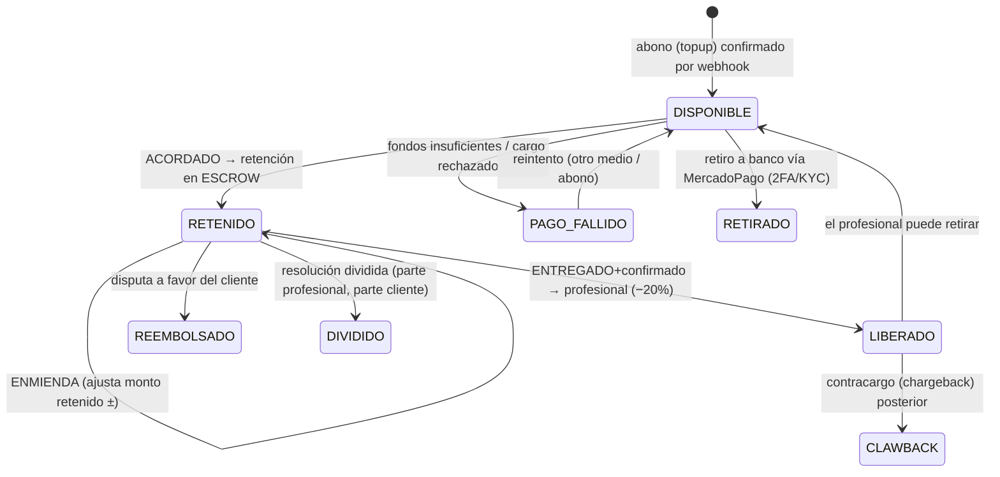
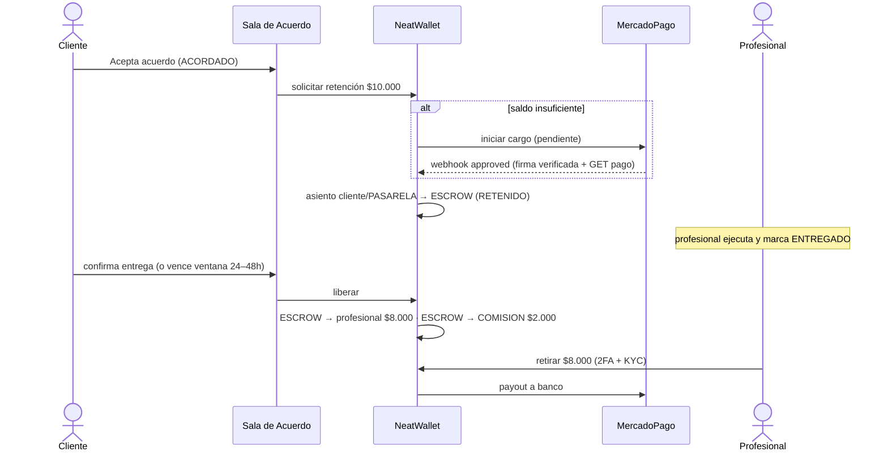

# NeatWallet™ — Billetera, Escrow y Contabilidad de Partida Doble
### Tomo Técnico IV · Deep-dive del sistema económico
**Base:** prompt de Erick (billetera, abonar/recibir/retirar, comisión 20%), Manifiesto Etapa 3 (Economía) y Cap. 74 (Confianza). Integra las decisiones del panel multirol: ledger de partida doble, cuentas de sistema, webhook de MercadoPago como fuente de verdad, liberación con confirmación dual y estados `PAGO_FALLIDO`/`ENTREGADO` de `03-Sala-de-Acuerdo.md`. Se apoya en el modelo de datos de `01-Arquitectura-NeatSpace.md`.

---

## 1. Principio de diseño (por qué un ledger y no un saldo)

> "La NeatWallet guardará el dinero de la gente y la gente podrá retirar su dinero cuando ellos quieran." (prompt de Erick)

Guardar dinero de terceros exige **corrección contable absoluta**. Por eso NeatWallet **no es un campo `saldo` que se suma y se resta** ⛔ — eso es la receta del descuadre y del fraude. Es un **libro mayor de partida doble, append-only**, donde:

- Cada movimiento de dinero es una **transacción balanceada**: sale de una cuenta y entra en otra, `Σ salidas = Σ entradas`.
- El **saldo de cualquier cuenta es una proyección** (`Σ créditos − Σ débitos`), recomputable desde cero — igual que el Trust Score se deriva del `ReputationLog` (doc 01, §1.4). Si el saldo cacheado y el ledger discrepan, **gana el ledger**.
- Nada se edita ni se borra. Un error se corrige con un **asiento de reverso**, nunca sobrescribiendo. Esto da la trazabilidad que exige el Art. V (transparencia) y la evidencia para conflictos (Biblia cap. 17).

**La regla madre del dinero** (heredada de la Sala de Acuerdo): *el dinero se retiene al acordar y solo se libera cuando la entrega se confirma.* Ninguna liberación es unilateral.

---

## 2. Modelo de cuentas (plan de cuentas)

Toda cuenta es una `neatwallet`. Hay tres clases:

| Clase | Cuentas | Naturaleza | Saldo negativo |
|---|---|---|---|
| **Usuario** | Billetera de cada persona (perfil dual: la misma billetera para cobrar y pagar). | Pasivo de NeatSpace (le debemos su dinero). | ❌ Prohibido (salvo cuenta de recupero, §8.3). |
| **Empresa** | Billetera corporativa de cada Empresa (NeatBusiness, 1—1). | Pasivo. | ❌ |
| **Sistema** | `ESCROW` (fondos en custodia), `COMISION_NEATSPACE` (ingresos), `PASARELA` (dinero en tránsito en MercadoPago), `REEMBOLSOS`, `RECUPERO` (deudas por clawback), `COSTO_PSP` (comisiones del PSP absorbidas, §5.8). | Interna. | ✅ Permitido y esperado. |

Restricción de integridad (heredada de doc 01 §1.3): `CHECK` de identidad **XOR** — una billetera pertenece a un usuario, **o** a una empresa, **o** es de sistema; nunca a dos.

```
neatwallet(
  id PK, tipo /* usuario | empresa | sistema */,
  usuario_id FK NULL, empresa_id FK NULL, rol_sistema NULL /* escrow|comision|pasarela|reembolsos|recupero|costo_psp */,
  moneda default 'CLP', creado_en,
  CHECK ( num_nonnull(usuario_id, empresa_id, rol_sistema) = 1 )
)
```

---

## 3. Partida doble: la mecánica

Cada evento económico crea **una `transaccion`** (agrupador) con ≥2 `ledger_entry`. Convención de lectura: **`ORIGEN → DESTINO monto`** (débito al origen, crédito al destino).

```
transaccion(
  id PK, tipo /* topup|retencion|liberacion|reembolso|reverso|retiro */,
  referencia_dominio /* servicio_id | pago_id | retiro_id */,
  idempotency_key UQ, creado_en
)

ledger_entry(
  id PK, transaccion_id FK, wallet_id FK→neatwallet,
  direccion /* debito | credito */, monto int, concepto, creado_en
)   -- APPEND-ONLY. Sin UPDATE/DELETE.
```

**Invariantes del sistema (se validan en cada escritura y en el job de conciliación):**
1. `Σ débitos = Σ créditos` **por transacción** (transacción balanceada).
2. `Σ de TODOS los ledger_entry del sistema = 0` (el dinero ni se crea ni se destruye internamente).
3. `saldo(w) = Σ créditos(w) − Σ débitos(w)`; para billeteras usuario/empresa `saldo ≥ 0`.
4. `saldo(ESCROW) = Σ montos de acuerdos con fondos retenidos activos`.
5. **Conciliación externa:** `saldo(PASARELA) + retiros_liquidados ≈ fondos reportados por MercadoPago` (job periódico, §6.4).

---

## 4. El ciclo del dinero (atado a los estados de la Sala de Acuerdo)



El financiamiento del escrow admite **dos vías, combinables** (reconcilia el prompt —billetera— con los mockups —"Pagar con MercadoPago"—):
- **(a) Desde saldo:** si el cliente tiene saldo suficiente, se retiene del saldo.
- **(b) Cargo directo:** el faltante se cobra a la tarjeta vía MercadoPago **directo a ESCROW** en el momento de acordar. No obliga a precargar.

Si ni (a) ni (b) prosperan → `PAGO_FALLIDO`; el Acuerdo **no** llega a `ACORDADO` (regla madre del §1 de doc 03).

---

## 5. Asientos contables por evento (ejemplos con cifras)

Ejemplo base: servicio de **$10.000**, comisión NeatSpace **20% = $2.000**.

### 5.1 Abono (topup) — cliente carga $10.000
| Origen (débito) | Destino (crédito) | Monto |
|---|---|---|
| PASARELA | Billetera cliente | $10.000 |

*Se asienta **solo cuando el webhook de MercadoPago confirma `approved`** (§6). Nunca al iniciar el cargo.*

### 5.2 Retención (escrow) — al pasar a ACORDADO
| Origen (débito) | Destino (crédito) | Monto |
|---|---|---|
| Billetera cliente | ESCROW | $10.000 |

*Si el saldo no cubre, la vía (b) inserta primero un asiento `PASARELA → ESCROW` por el faltante.*

### 5.3 Liberación — al CERRAR (entrega confirmada)
| Origen (débito) | Destino (crédito) | Monto |
|---|---|---|
| ESCROW | Billetera profesional | $8.000 |
| ESCROW | COMISION_NEATSPACE | $2.000 |

*ESCROW queda en 0 para ese acuerdo; `comision = round(total × 0.20)` y el neto del profesional es el **complemento exacto** `neto = total − comision` (nunca `round(total × 0.80)`, que podría descuadrar en $1 y romper la transacción balanceada). Todo calculado **server-side**.*

### 5.4 Reembolso total — disputa a favor del cliente (antes de liberar)
| Origen (débito) | Destino (crédito) | Monto |
|---|---|---|
| ESCROW | Billetera cliente | $10.000 |

*⛔ **No se cobra comisión sobre un reembolso.** COMISION no participa.*

### 5.5 Resolución dividida — p. ej. profesional recibe $6.000
| Origen (débito) | Destino (crédito) | Monto |
|---|---|---|
| ESCROW | Billetera profesional | $4.800 |
| ESCROW | COMISION_NEATSPACE | $1.200 |
| ESCROW | Billetera cliente | $4.000 |

*Comisión **proporcional** solo sobre lo efectivamente pagado al profesional ($6.000 × 20%). El reembolso ($4.000) va sin comisión.*

### 5.6 Reverso de comisión / clawback — contracargo tras liberar
| Origen (débito) | Destino (crédito) | Monto |
|---|---|---|
| COMISION_NEATSPACE | REEMBOLSOS | $2.000 |
| Billetera profesional | REEMBOLSOS | $8.000 |

*El contracargo lo ejecuta MercadoPago retirando el dinero de la cuenta recaudadora; por eso el saldo que se acumula en `REEMBOLSOS` se cierra con una **segunda pata** `REEMBOLSOS → PASARELA` que refleja la salida real de fondos y mantiene el invariante #2 (Σ = 0). Si el profesional **ya retiró** los $8.000, su billetera queda negativa → se traslada a `RECUPERO` (deuda) y se activa el proceso de recobro (§8.3). Los **periodos de retención en el retiro** (§8) existen para minimizar este caso.*

### 5.7 Retiro — profesional retira $8.000
| Origen (débito) | Destino (crédito) | Monto |
|---|---|---|
| Billetera profesional | PASARELA | $8.000 |

*Luego MercadoPago ejecuta el payout a la cuenta bancaria. Requiere 2FA + KYC (§8).*

### 5.8 Comisión del PSP (MercadoPago) — decisión abierta ⚠️

MercadoPago cobra su propia comisión por procesar cada cargo/payout. Los ejemplos anteriores usan cifras **limpias** (como los mockups: `$15.000 → −$3.000 → recibe $12.000`), pero ese costo real **existe y debe asentarse**. Se registra contra la cuenta de sistema `COSTO_PSP`:

| Origen (débito) | Destino (crédito) | Monto |
|---|---|---|
| COSTO_PSP | PASARELA | comisión MercadoPago |

**Quién lo absorbe es una decisión de negocio abierta**, no de ingeniería: (a) NeatSpace lo absorbe con cargo a `COMISION_NEATSPACE` (el profesional recibe el neto limpio de los mockups), o (b) se descuenta del neto del profesional (lo que sugiere el paréntesis "− comisiones MercadoPago" del §7). El modelo lo deja **aislado en `COSTO_PSP`** para cambiar la política sin tocar el resto del ledger. **A confirmar con Erick.**

---

## 6. Integración con MercadoPago

### 6.1 El webhook es la fuente de verdad ⛔
El estado de un `pago` **nunca** se determina por la respuesta del cliente ni por el redirect del navegador. Se determina por el **webhook (IPN) de MercadoPago**, confirmado con un `GET /v1/payments/{id}` server-side. `POST /v1/wallet/pay` **solo inicia el intento** (estado `pendiente`); el asiento contable se crea **al recibir `approved`**.

### 6.2 Seguridad del webhook
- **Verificación de firma** `x-signature` (HMAC) en cada notificación.
- **Idempotencia:** cada evento de MercadoPago trae un id único → se deduplica; reprocesar el mismo evento no duplica asientos.
- **Anti-replay:** ventana temporal + registro de eventos ya vistos.
- **Confirmación activa:** ante cualquier webhook, se consulta el pago a la API antes de asentar (defensa contra webhooks falsificados).

### 6.3 Modelo de escrow (decisión abierta, gancho legal)
MercadoPago en Chile no ofrece un *escrow* de larga duración nativo. Dos caminos:
- **Custodia interna:** los fondos se cobran a la cuenta recaudadora de NeatSpace y se rastrean con el ledger interno (cuenta `ESCROW`). **⚠️ Implicancia regulatoria:** custodiar dinero de terceros puede caer bajo la **Ley Fintec 21.521** y supervisión **CMF** (ver doc 01 §2.5). **Requiere validación legal.**
- **Split payment al liberar:** se difiere el cobro y se usa el `application_fee`/marketplace para separar comisión al momento de la liberación. Menos custodia, pero menos control del timing.

> Esto es un **riesgo abierto marcado**, no una decisión cerrada. Ningún agente reemplaza a un abogado fintech chileno.

### 6.4 Conciliación
Un **job periódico** compara el ledger interno (`PASARELA`, retiros, escrow) contra los **reportes de liquidación de MercadoPago**. Toda discrepancia genera una alerta y una entrada de investigación. La conciliación es la red de seguridad de todo sistema de dinero.

### 6.5 Estados de pago y su mapeo
| MercadoPago | NeatWallet | Acción |
|---|---|---|
| `pending` / `in_process` | pago pendiente | esperar webhook |
| `approved` | confirmado | asentar (topup o retención) |
| `rejected` | fallido | → `PAGO_FALLIDO`, ningún asiento |
| `refunded` | reembolsado | asiento de reembolso |
| `charged_back` | contracargo | asiento de clawback (§5.6) |

### 6.6 Secuencia: pago → escrow → liberación



---

## 7. Comisión NeatSpace (20%)

- `comision = round(total × 0.20)`, **calculada y aplicada server-side** — nunca llega desde el cliente (doc 01, regla ⛔).
- Se **devenga solo al liberar** al profesional. Mientras el dinero está en `ESCROW`, la comisión **no está ganada**.
- **Nunca se cobra sobre un reembolso.** En resolución dividida, es **proporcional** a lo efectivamente pagado (§5.5).
- Transparencia (Cap. 44 + panel): el desglose `bruto − comisión 20% (− comisiones MercadoPago) = neto` es **visible antes de aceptar** en la Sala de Acuerdo, tal como en los mockups (`$15.000 → −$3.000 → recibe $12.000`).
- Destino declarado (prompt de Erick): la comisión financia la mejora del sistema y la comunidad → se refleja como ingreso en `COMISION_NEATSPACE`.

---

## 8. Retiros, KYC y control de riesgo

### 8.1 Flujo de retiro
`POST /v1/wallet/withdraw` → validaciones → `Billetera → PASARELA` → payout MercadoPago.
- **2FA obligatorio** (operación sensible, doc 01 §2.3.2).
- **Verificación de cuenta bancaria** a nombre del titular (anti-lavado / anti-testaferro).
- **Umbral KYC:** sobre cierto monto acumulado, se exige verificación de identidad reforzada (gancho Ley Fintec/UAF — validar con legal).

### 8.2 Periodo de retención (hold)
Los fondos recién liberados pueden tener un **hold corto** antes de ser retirables, dimensionado por la ventana de disputa/contracargo. Minimiza el clawback sin fondos (§5.6). Configurable por categoría de riesgo.

### 8.3 Clawback y cuenta RECUPERO
Si un contracargo llega tras un retiro ya ejecutado, la billetera del profesional quedaría negativa. Como las billeteras usuario **no admiten saldo negativo**, la deuda se traslada a `RECUPERO` (cuenta de sistema que sí lo admite) y se abre un proceso de recobro (retención de cobros futuros, acuerdo de pago). Es una **pérdida potencial declarada**, acotada por los holds y por límites de retiro.

### 8.4 Límites y detección de anomalías
- Límites de monto/velocidad por día y por operación.
- Detección de patrones inusuales (topup grande + retiro inmediato = posible lavado; ping-pong entre cuentas ligadas = ya bloqueado por el filtro anti-Sybil de NeatMatch §4.2 + detección de desintermediación de doc 01 §2.3.1).

---

## 9. API

```
GET   /v1/wallet                       # saldo (derivado) + movimientos paginados
POST  /v1/wallet/topup                 # inicia abono vía MercadoPago (Idempotency-Key)
POST  /v1/webhooks/mercadopago         # FUENTE DE VERDAD: firma HMAC, dedup, confirma y asienta
POST  /v1/services/{id}/hold           # retención en escrow al ACORDAR (interno, desde Sala de Acuerdo)
POST  /v1/services/{id}/release        # liberación (solo con confirmación dual; comisión 20%)
POST  /v1/services/{id}/refund         # reembolso total/parcial (desde Resolución de Conflictos)
POST  /v1/wallet/withdraw              # retiro a banco (2FA + KYC, Idempotency-Key)
GET   /v1/wallet/transactions/{id}     # detalle auditable de una transacción (todos sus asientos)
```

**Reglas embebidas (no negociables):**
- Toda escritura de dinero exige **`Idempotency-Key`** → 400 si falta.
- `POST /pay|/topup` **no** asienta; solo el webmook `approved` asienta.
- `POST /release` → 409 si el servicio no está `ENTREGADO`+confirmado (o ventana vencida). Nunca libera unilateralmente.
- La comisión **jamás** viaja en el request: se deriva de `total`.
- **Autorización obligatoria (anti-IDOR):** `/topup`, `/withdraw` y `GET /wallet*` exigen la sesión del **dueño** de la billetera; `GET /wallet/transactions/{id}` verifica pertenencia antes de responder (doc 02 §10). `/hold`, `/release` y `/refund` son **internos** (los invoca la Sala de Acuerdo / Resolución de Conflictos con auth servicio-a-servicio), nunca expuestos al cliente.

---

## 10. Casos borde

| Situación | Manejo |
|---|---|
| Webhook duplicado | Dedup por event-id → no duplica asiento (invariante idempotencia). |
| Cargo aprobado pero app cae antes de asentar | El webhook se reintenta / la conciliación lo detecta; asiento diferido idempotente. |
| Retención con saldo parcial | Vía (a) por el saldo + vía (b) por el faltante, en la misma transacción. |
| Enmienda que sube el precio | Retención adicional al escrow antes de continuar (doc 03 R3). |
| Enmienda que baja el precio | Devolución del excedente del escrow al cliente. |
| Contracargo tras retiro | Clawback → cuenta `RECUPERO` + recobro (§8.3). |
| Doble clic en "retirar" | Idempotency-Key evita el doble payout. |
| Descuadre ledger vs MercadoPago | Alerta de conciliación + congelamiento de la cuenta afectada para investigación. |

---

## 11. Validación contra las restricciones de negocio

| Decisión | Oportunidades | Confianza | Ética | Largo plazo |
|---|---|---|---|---|
| Ledger de partida doble append-only | ✅ | ✅✅ dinero trazable | ✅ auditable | ✅✅ recomputable |
| Escrow + liberación con confirmación dual | ✅ profesional cobra seguro | ✅✅ | ✅ sin abuso unilateral | ✅ |
| Webhook como fuente de verdad | ➖ | ✅✅ anti-fraude | ✅ | ✅ |
| Comisión nunca sobre reembolso | ✅ justo | ✅✅ | ✅✅ | ✅ |
| Holds + clawback controlado | ✅ | ✅ | ✅ | ✅ acota pérdidas |
| Ganchos Ley Fintec marcados abiertos | ➖ | ✅ honestidad | ✅✅ cumplimiento | ✅✅ |

> **Riesgo abierto principal:** el modelo de custodia de fondos (§6.3) y los umbrales KYC (§8.1) deben validarse con un **abogado fintech chileno** frente a la **Ley 21.521 (Fintec)**, la normativa **CMF** y **UAF**. La arquitectura los deja aislados y marcados para no bloquear el MVP, pero **no** son decisiones que la ingeniería pueda cerrar sola.
