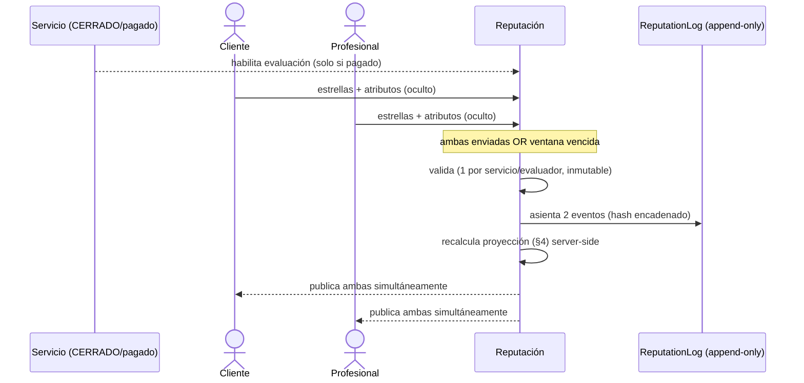

# Trust Score™ — Reputación Verificable y a Prueba de Manipulación
### Tomo Técnico V · Deep-dive del sistema de reputación
**Base:** prompt de Erick (puntaje 0–100 desde calificaciones; habilidades blandas: eficiente, rápido, amable, profesional…), Manifiesto Cap. 74 (Sistema de Confianza Total, Índice Global de Confianza, segundas oportunidades) y Carta del Fundador ("la reputación se construye, no se escribe"). Integra las decisiones del panel multirol (evaluación *double-blind*, badge de cold-start, detección de desintermediación) y se apoya en `01-Arquitectura-NeatSpace.md` (§2.3.1, `ReputationLog`).

---

## 1. Qué es el Trust Score (y qué NO es)

> "La reputación no se comprará. No se regalará. Se construirá." (Cap. 74, Pilar II)

El Trust Score es el número **0–100** que resume la reputación de una persona dentro de NeatSpace. Tres definiciones que gobiernan todo el diseño:

1. **Es una proyección derivada, no una fuente de verdad.** ⛔ No existe un campo `trust_score` que un endpoint pueda "setear". El valor se **calcula server-side** a partir del `ReputationLog` (append-only), y es **recomputable desde cero** en cualquier momento. Si el valor cacheado y el log discrepan, gana el log.
2. **Se gana con transacciones reales, no con opiniones sueltas.** Solo un servicio **completado y pagado** (escrow liberado, doc 04) puede generar una evaluación. Sin transacción no hay reseña. Esto elimina de raíz el spam de reputación.
3. **Es el patrimonio del usuario** (Art. III, Cap. 5). Se administra con el mismo rigor que el dinero de la NeatWallet: inmutable, trazable, auditable.

---

## 2. Captura de la evaluación (bidireccional y *double-blind*)

Al cerrar un servicio, **ambas partes** se evalúan (cliente↔profesional). La captura respeta la "Regla de los 3 segundos" (Cap. 44): nada de pedirle al usuario que escriba números 0–100.

**Qué entrega el evaluador:**
- **Estrellas 1–5** (señal global).
- **Atributos** (habilidades blandas del prompt) como *tags* de un toque: `amable`, `rápido`, `eficiente`, `profesional`, `puntual`, `prolijo`… El evaluador marca los que aplican.
- Comentario opcional.

> El usuario **no ingresa** el 0–100. El sistema **deriva** el 0–100 (global y por atributo) a partir de estas señales simples. La escala 0–100 del prompt de Erick es la **capa de presentación**, no la de entrada.

**Double-blind (anti-represalia — panel multirol, doc 01 §2.3.1 pto 9):** la calificación de cada parte permanece **oculta hasta que ambas la envíen** o venza una ventana. Se publican **simultáneamente**. Así nadie califica "esperando a ver" ni por miedo a la revancha.



**Reglas de integridad de la evaluación:**
- **Una** evaluación por `(servicio, evaluador)`. `UQ(servicio_id, evaluador_id)`.
- **Inmutable al enviar** (no se edita ni borra; una corrección es un evento nuevo).
- Solo existe si el `servicio` está `pagado` → si no, la API responde **409**.
- El **comentario** pasa por **moderación y limpieza de PII** antes de publicarse (anti-difamación, datos de contacto, Ley 21.719 y 19.496); es **reportable** y puede ocultarse conservando la señal numérica. Nada de esto altera el evento asentado en el `ReputationLog`.

---

## 3. El `ReputationLog`: reputación como event sourcing

Cada evento que afecta la reputación entra en un **libro append-only encadenado por hash**:

```
reputation_log(
  id PK, usuario_id FK, evento /* evaluacion | sancion | verificacion | apelacion | decay */,
  payload jsonb, evaluacion_id FK NULL,
  hash_prev, hash_actual,          -- hash_actual = H(hash_prev ‖ payload)
  creado_en
)   -- SIN UPDATE / SIN DELETE
```

- **Encadenamiento por hash:** alterar un evento pasado rompe la cadena y es detectable en auditoría. Da integridad criptográfica al patrimonio reputacional.
- **El Trust Score es la *proyección* materializada** de este log. Se puede reconstruir reproduciendo los eventos — igual que el saldo de la NeatWallet se reconstruye del ledger (doc 04) y con la misma filosofía que el mapa de datos "Patrimonio" (doc 01 §1.4).
- Eventos no-evaluación también viven aquí: sanciones (Art. IX), mejoras de verificación de identidad, resultados de apelación, y *checkpoints* de decaimiento (§6).
- **Inmutabilidad vs. derechos de datos (Ley 21.719):** el log es append-only, pero la ley concede rectificación/supresión de datos personales. Se concilian **separando el dato numérico/hash (patrimonio, se preserva) del PII/comentario (redactable con *tombstone*)**, con la misma separación contenido/PII de doc 01 §2.4. Se borra el texto, no se rompe la cadena.

---

## 4. Cómo se calcula el 0–100 (fórmula)

### 4.1 Trust Score global (bayesiano)

El promedio simple es frágil: un profesional con **una** reseña de 5★ no puede valer 100/100. Se usa una **media bayesiana** que parte de un *prior* (la media global `m`) y se va ganando con volumen y peso:

```
TrustScore = round( 100 · ( C·m̄ + Σ_i ω_i · s_i ) / ( C + Σ_i ω_i ) )
```

| Símbolo | Significado |
|---|---|
| `s_i` | rating normalizado de la evaluación *i* (estrellas → [0,1]) |
| `m̄` | media global normalizada del ecosistema (el *prior*) |
| `C` | fuerza del prior (nº de evaluaciones "virtuales"): a mayor `C`, más lento se aleja del promedio |
| `ω_i` | **peso** de la evaluación *i* (§4.3) |

Efecto: un novato arranca **cerca de `m`** (ni en 0 ni en 100), y su score se mueve hacia su valor real a medida que acumula evaluaciones ponderadas.

### 4.2 Puntaje por atributo (habilidades blandas 0–100)

Para cada atributo `a` (amable, rápido, eficiente, profesional…), el 0–100 es la **proporción ponderada y suavizada** de servicios donde ese atributo fue afirmado:

```
attr(a) = round( 100 · ( C_a·p_a + Σ_i ω_i · 1[a afirmado en i] ) / ( C_a + Σ_i ω_i ) )
```

donde `p_a` es la tasa base global del atributo. Se muestran como barras 0–100 en el NeatProfile — que es exactamente la "reputación dentro de la app" que describe el prompt de Erick.

### 4.3 Peso de cada evaluación `ω_i`

No todas las evaluaciones pesan igual (esto es clave anti-manipulación):

```
ω_i = ω_recencia(i) · ω_evaluador(i) · ω_verificacion(i)
```

- **`ω_recencia`** — decae con la antigüedad (p. ej. semivida de 12 meses). Sostiene las "segundas oportunidades" (§6): el pasado pesa menos.
- **`ω_evaluador`** — evaluaciones de cuentas con mayor Trust Score y buen historial pesan más; cuentas nuevas o sospechosas, menos (mitiga anillos de bots). Este peso está **acotado por un techo**: no puede crear un bucle "el rico se hace más rico" ni una oligarquía de cuentas semilla de score alto (tensión con el Art. II y el cold-start del §5), y no reemplaza la revisión humana del §7.
- **`ω_verificacion`** — evaluaciones de evaluadores con identidad verificada pesan más (Pilar I, Cap. 74).

---

## 5. Cold-start: el novato no arranca ni en 0 ni en 100

- Con `n = 0`, el score bayesiano ≈ `100·m̄` (la media global), pero la **UI no muestra un número** que confunda: muestra el badge **"Nuevo en NeatSpace" / "Sin historial aún"** (decisión del panel multirol, doc 02 §2.3.1 pto 4).
- Combinado con el **boost de exploración de NeatMatch** (doc 02 §4.4), el novato **consigue impresiones reales** para ganar sus primeras evaluaciones. KPI: *tiempo hasta la primera oportunidad*.
- Esto operacionaliza el Art. II (igualdad) y el Principio 8 ("las oportunidades deberán llegar también a quienes recién comienzan").

---

## 6. Segundas oportunidades y rehabilitación (Cap. 74)

> "Creemos en la responsabilidad. Pero también en las segundas oportunidades." (Cap. 74)

- **Decaimiento por recencia** (`ω_recencia`): un mal periodo no marca de por vida; el comportamiento reciente domina.
- **Las sanciones graves de seguridad no decaen como una mala estrella:** el `ω_recencia` alivia el peso de *ratings* antiguos, pero una sanción por riesgo (categorías sensibles, doc 02 §4.2) **persiste** hasta cumplir su ruta de rehabilitación explícita — un mal actor no puede simplemente "esperar a que expire".
- **Ruta de rehabilitación:** tras una sanción o una racha negativa, el usuario puede reconstruir su score con nuevos servicios bien evaluados. El log conserva la historia (transparencia), pero la **proyección** premia la mejora.
- **Proporcionalidad y debido proceso** (Art. IX, Principio 39): las sanciones que afectan la reputación son proporcionales, documentadas y **apelables**; su resultado entra al `ReputationLog` como evento trazable.

---

## 7. Defensa contra manipulación (resumen operativo)

| Vector de ataque | Defensa |
|---|---|
| Reseñas falsas sin trabajo | ⛔ No hay evaluación sin `servicio` **pagado**. |
| Auto-contratación / Sybil | Filtro duro anti-Sybil de NeatMatch (§4.2) + `ω_evaluador` bajo para cuentas ligadas. |
| Anillos recíprocos (A↔B) | Detección de patrones recíprocos/velocidad/dispositivo-IP-pago → marca para revisión humana (no sanción automática ciega, Art. IX). |
| Represalia / coerción | Evaluación **double-blind** (§2). |
| Inflar el propio puntaje | El usuario **no escribe** su 0–100; todo es derivado server-side. |
| Comprar reputación | La reputación no es transferible ni editable; solo se gana con transacciones. |
| Llevar el trato "por fuera" (desintermediación) | Detección de contacto externo (doc 01 §2.3.1 pto 10; doc 03 §7) → advertencia + degradación de visibilidad a reincidentes. |
| Alteración del historial | `ReputationLog` encadenado por hash → cualquier cambio rompe la cadena. |
| Spam de velocidad | Rate limiting + `ω_evaluador`/`ω_recencia`. |

---

## 8. Índice Global de Confianza (métrica institucional ≠ score individual)

Distinto del Trust Score de cada persona: el **Índice Global de Confianza** (Cap. 74) mide la **salud del ecosistema** —cumplimiento, resolución de conflictos, seguridad, satisfacción, transparencia, calidad de las interacciones—. Alimenta el **Panel del Fundador** (Cap. 50) y sirve para **mejorar la plataforma, no para etiquetar personas**. Es el termómetro de que la confianza —el patrimonio— se mantiene sana a escala.

---

## 9. Niveles de verificación de identidad

La **Identidad Verificada** (Pilar I, Cap. 74) no es parte del score, pero lo potencia:
- Sube `ω_verificacion` de las evaluaciones que emite el usuario.
- Habilita **categorías sensibles** (p. ej. cuidado infantil) vía los filtros duros de NeatMatch (§4.2).
- Se muestra como **badge de verificado** en el NeatProfile (brecha detectada en el análisis de mockups, doc 01 §4).

---

## 10. Modelo de datos (proyección + captura)

```
evaluacion(
  id PK, servicio_id FK, evaluador_id FK→usuario, evaluado_id FK→usuario,
  estrellas int /*1..5*/, atributos jsonb /* {amable:true, rapido:true, ...} */,
  comentario, visible bool default false,      -- double-blind
  creado_en, UQ(servicio_id, evaluador_id)
)  ↑IDX(evaluado_id)

trust_score(                                   -- PROYECCIÓN (recomputable)
  neatprofile_id PK FK, valor_0_100 int, valor_bayesiano numeric,
  atributos_0_100 jsonb /* {amable:88, rapido:73, ...} */,
  n_evaluaciones int, nivel_verificacion int, recalculado_en
)  ↑IDX(valor_0_100 DESC)                       -- ranking en NeatMatch

reputation_log(...)                            -- append-only encadenado (§3, doc 01)
```

`trust_score` se llavea por `neatprofile_id` y `reputation_log`/`evaluacion` por `usuario_id`: cada usuario tiene **un** NeatProfile (1—1, doc 01), que es la unidad de reputación.

Consistencia: `trust_score` se recalcula al asentar cada evaluación y puede **reconstruirse** reproduciendo `reputation_log`. Un job de verificación compara proyección vs. log (como la conciliación de NeatWallet).

---

## 11. API

```
POST /v1/services/{id}/reviews          # evaluar (409 si el servicio no está pagado)
GET  /v1/profiles/{id}/trust-score      # {valor_0_100, atributos_0_100, nivel, n, badge}
GET  /v1/profiles/{id}/reputation       # historial público paginado (derivado del log)
# interno:
POST /internal/reputation/recompute/{profileId}   # recomputa proyección desde el log
```

**Reglas embebidas:**
- `POST /reviews` → **409** si el servicio no está **pagado** (el estado terminal `CERRADO` de doc 03 = escrow liberado en doc 04; "pagado" es ese hito, no un estado aparte).
- El cuerpo **nunca** trae el puntaje 0–100 (solo estrellas + atributos). El score se deriva.
- Respuesta de `trust-score` para no-clientes: sin datos crudos que permitan IDOR (doc 02 §10).

---

## 12. Casos borde

| Situación | Manejo |
|---|---|
| Solo una parte evalúa | Se publica al vencer la ventana; la que no evaluó no penaliza a la otra. |
| Evaluación con 1 sola reseña | Bayesiano evita 100/100; UI muestra badge de novato. |
| Profesional multi-categoría | El score global y los atributos pueden segmentarse por categoría para el ranking de NeatMatch. |
| Sanción luego revertida en apelación | Evento de reverso en el log; la proyección se recomputa. |
| Intento de editar una reseña enviada | Bloqueado (inmutable); se admite una nota/evento nuevo. |
| Descuadre proyección vs log | Alerta + recompute desde el log (el log manda). |
| Perfil dual (mismo usuario cliente y profesional) | El Trust Score y los atributos se **segmentan por rol** (actuación como cliente vs. profesional): una mala conducta como cliente no contamina la reputación profesional y viceversa; el ranking de NeatMatch usa la faceta profesional. La dimensión de rol se captura en `evaluacion.rol_evaluado {cliente\|profesional}` (doc 08); la proyección por faceta se deriva de ahí. |

---

## 13. Validación contra las restricciones de negocio

| Decisión | Oportunidades | Confianza | Ética | Largo plazo |
|---|---|---|---|---|
| Score derivado del log append-only | ✅ mérito real | ✅✅ patrimonio | ✅ auditable | ✅✅ recomputable |
| Sin reseña sin transacción pagada | ✅ | ✅✅ | ✅ | ✅ |
| Media bayesiana + cold-start badge | ✅✅ talento nuevo | ✅ anti-inflado | ✅✅ igualdad | ✅ |
| Double-blind | ✅ | ✅✅ | ✅✅ anti-represalia | ✅ |
| Decay + rehabilitación | ✅ segundas oportunidades | ✅ | ✅✅ | ✅ |
| Anti-colusión con revisión humana | ✅ | ✅✅ | ✅ debido proceso | ✅ |
| Índice Global (no etiqueta personas) | ➖ | ✅ salud del sistema | ✅✅ | ✅✅ |
