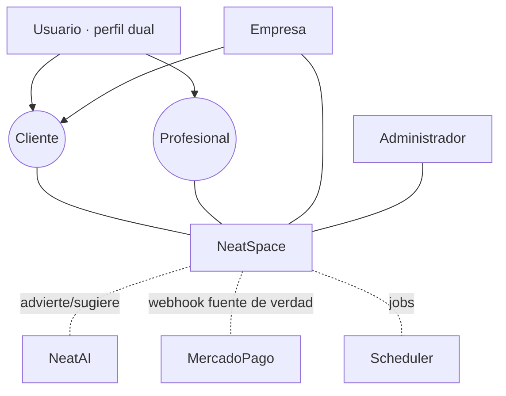

# Casos de Uso y Actores — NeatSpace
### Tomo Técnico VI · La capa de análisis que ancla el contrato

**Base:** docs 01–05 (arquitectura, NeatMatch, Sala de Acuerdo, NeatWallet, Trust Score) y los contratos `specs/openapi.yaml` (35 endpoints) y `specs/asyncapi.yaml` (15 eventos). Este documento **consolida** los flujos que hoy viven dispersos en los deep-dives y los formaliza como casos de uso, para que **cada endpoint y cada evento trace a un caso de uso** (columna vertebral SDD, `specs/README.md`).

---

## 1. Actores

| Actor | Tipo | Descripción |
|---|---|---|
| **Usuario** | Primario | Persona con **perfil dual**: una misma cuenta actúa como Cliente y/o Profesional (doc 01). Generaliza a las dos facetas de abajo. |
| ↳ **Cliente** | Primario (faceta) | Publica oportunidades, negocia, paga, evalúa. |
| ↳ **Profesional** | Primario (faceta) | Toma/postula oportunidades, ejecuta, cobra, evalúa. |
| **Empresa** | Primario | Cuenta corporativa (NeatBusiness). Variante paramétrica del modo Programado (doc 02 §4.3). |
| **Administrador** | Primario | Modera, resuelve disputas, ejerce acciones con doble autorización maker-checker (doc 01 §1.4). |
| **NeatAI** | Sistema (interno) | Asistente de la Sala de Acuerdo, detección de contacto externo, priorización de casos. **Solo advierte / sugiere; no decide** (doc 03 §7, doc 01 §2.2). |
| **MercadoPago** | Sistema (externo) | PSP. Su **webhook es la fuente de verdad** del pago (doc 04 §6). |
| **Scheduler** | Sistema (interno) | Jobs: conciliación, auto-liberación por vencimiento, decay de reputación, generación de recurrentes. |

---

## 2. Catálogo de casos de uso (trazabilidad a specs)

| ID | Caso de uso | Actor | Endpoint(s) `openapi.yaml` | Evento(s) `asyncapi.yaml` |
|---|---|---|---|---|
| **Identidad** |
| CU-01 | Registrarse (crea Usuario+NeatProfile+NeatWallet, atómico) | Usuario | `POST /auth/register` | — |
| CU-02 | Iniciar sesión | Usuario | `POST /auth/login` | — |
| CU-03 | Editar NeatProfile / cobertura | Usuario | `PATCH /me/profile`, `GET /profiles/{id}` | — |
| CU-04 | Explorar categorías | Usuario | `GET /categories` | — |
| **Oportunidades** |
| CU-05 | Publicar oportunidad (urgente/programada) | Cliente | `POST /opportunities` | `OportunidadCreada` |
| CU-06 | Explorar feed (geo enmascarada) | Profesional | `GET /opportunities`, `GET /opportunities/{id}` | — |
| CU-07 | Postular (programado) | Profesional | `POST /opportunities/{id}/applications` | — |
| CU-08 | Revisar postulaciones | Cliente | `GET /opportunities/{id}/applications` | — |
| **NeatMatch** |
| CU-09 | Obtener ranking de profesionales (reason codes) | Cliente | `GET /opportunities/{id}/matches` | — |
| CU-10 | Asignación atómica urgente (primero-gana) | Profesional | *(interno, dispatch)* | `OportunidadTomada` |
| **Sala de Acuerdo** |
| CU-11 | Abrir Sala de Acuerdo | Cliente/Profesional | `POST /opportunities/{id}/agreement`, `GET /agreements/{id}` | — |
| CU-12 | Proponer versión de términos | Cliente/Profesional | `POST /agreements/{id}/versions` | — |
| CU-13 | Contraoferta con justificación (Precio Justo) | Cliente/Profesional | `POST /agreements/{id}/price-offers`, `.../accept` | — |
| CU-14 | Aceptar acuerdo (step-up) → retención escrow | Cliente/Profesional | `POST /agreements/{id}/accept` | `AcuerdoAceptado`, `DireccionRevelada`, `RetencionEscrowFallida` |
| CU-15 | Enmienda en ejecución | Cliente/Profesional | `POST /agreements/{id}/amendments` | — |
| CU-16 | Marcar trabajo entregado | Profesional | `POST /agreements/{id}/deliver` | `TrabajoEntregado` |
| CU-17 | Confirmar entrega → cierre + liberación | Cliente | `POST /agreements/{id}/confirm` | `ServicioPagado`, `EscrowLiberado` |
| CU-18 | Cancelar acuerdo | Cliente/Profesional | `POST /agreements/{id}/cancel` | `AcuerdoCancelado` |
| CU-19 | Mensajería de la sala (alerta NeatAI) | Cliente/Profesional | `GET/POST /agreements/{id}/messages` | — |
| CU-20 | Ejecutar / finalizar servicio | Profesional | `POST /services/{id}/start`, `.../finish` | `ServicioFinalizado` |
| **NeatWallet** |
| CU-21 | Abonar saldo (topup) | Usuario | `POST /wallet/topup` | — |
| CU-22 | Retener escrow al acordar | *(interno)* | `POST /services/{id}/hold` | — |
| CU-23 | Liberar escrow (comisión 20%) | *(interno)* | `POST /services/{id}/release` | `EscrowLiberado` |
| CU-24 | Reembolsar / dividir | Administrador | `POST /services/{id}/refund` | `ReembolsoEmitido` |
| CU-25 | Retirar a banco (2FA + KYC) | Profesional | `POST /wallet/withdraw` | — |
| CU-26 | Confirmar pago (fuente de verdad) | MercadoPago | `POST /webhooks/mercadopago` | `ContracargoRecibido` |
| CU-27 | Ver billetera / transacción | Usuario | `GET /wallet`, `GET /wallet/transactions/{id}` | — |
| CU-28 | Conciliar ledger vs PSP | Scheduler | *(job §6.4 doc 04)* | — |
| **Trust Score** |
| CU-29 | Evaluar (bidireccional, double-blind) | Cliente/Profesional | `POST /services/{id}/reviews` | `EvaluacionEnviada` |
| CU-30 | Ver Trust Score / reputación | Usuario | `GET /profiles/{id}/trust-score`, `.../reputation` | — |
| CU-31 | Recomputar proyección desde el log | *(interno)* | `POST /internal/reputation/recompute/{id}` | — |
| **Conflictos y gobernanza** |
| CU-32 | Abrir disputa (congela escrow) | Cliente/Profesional | `POST /services/{id}/disputes` | — |
| CU-33 | Resolver disputa | Administrador | *(interno → refund/release)* | `ReembolsoEmitido`/`EscrowLiberado` |
| CU-34 | Acción administrativa (maker-checker) | Administrador | *(interno)* | — |
| CU-35 | Apelar sanción | Usuario | *(interno → ReputationLog)* | — |

> **Endpoints sin CU** o **CU sin endpoint** son *hallazgos de trazabilidad*: CU-10, CU-28, CU-33, CU-34, CU-35 aún no tienen endpoint público explícito en `openapi.yaml` (son internos o de dispatch). Se registran aquí para cerrar la matriz en el paso de trazabilidad (doc 09).

### 2.1 Casos de uso complementarios (completitud — backlog / jobs)

El catálogo núcleo (CU-01..35) cubre el MVP. Estos CU **completan** el ciclo de vida y aún no tienen contrato en `specs/` — se exponen al implementar su módulo:

| ID | Caso de uso | Actor | Estado |
|---|---|---|---|
| CU-36 | Recuperar acceso · cerrar sesión · refrescar token | Usuario | endpoints de auth pendientes en `openapi.yaml` |
| CU-37 | Aceptar términos y **consentimiento de datos** (Ley 21.719) en el onboarding | Usuario | requisito legal; falta CU/endpoint |
| CU-38 | Administrar empresa, miembros y permisos (NeatBusiness) | Empresa (admin) | escribe `empresa_miembro`; NeatBusiness sin detallar |
| CU-39 | Cerrar ventana double-blind y publicar evaluaciones | Scheduler | job → `EvaluacionEnviada` |
| CU-40 | Decaimiento de reputación (checkpoint `decay`) | Scheduler | job → `reputation_log` |
| CU-41 | Generar oportunidades recurrentes | Scheduler | job → `OportunidadCreada` |
| CU-42 | Auto-liberación de escrow por vencimiento de ventana | Scheduler | job → `release` / `EscrowLiberado` |

---

## 3. Fichas detalladas (casos de uso críticos)

Plantilla: **Actor · Precondiciones · Flujo principal · Alternos · Excepciones · Postcondiciones · Reglas · Trazas.**

### CU-05 · Publicar oportunidad

- **Actor:** Cliente (o Empresa).
- **Precondiciones:** sesión activa; categoría válida.
- **Flujo principal:** 1) elige tipo (`urgent`/`scheduled`) y categoría; 2) fija geo **aproximada** y `precio_ref`; 3) publica.
- **Alternos:** 3a) recurrente → crea `oportunidad_recurrente` que genera instancias (Cap. 37).
- **Excepciones:** categoría sensible sin verificación → 422 / vía supervisada (doc 02 §6.2).
- **Postcondiciones:** `oportunidad.estado = publicado`; se emite `OportunidadCreada` (NeatMatch consume).
- **Reglas:** `tipo` es **inmutable**; la `direccion_texto` exacta **no** se expone aún (geo enmascarada, doc 01 §3.3).
- **Trazas:** `POST /opportunities` · `OportunidadCreada` · entidad `oportunidad`.

### CU-10 · Asignación atómica urgente (primero-gana)

- **Actor:** Profesional (varios compiten); dispatch interno.
- **Precondiciones:** oportunidad `urgent` en `publicado`; profesional en shortlist de NeatMatch.
- **Flujo principal:** 1) N profesionales reciben la oferta con geo aproximada; 2) el primero en aceptar gana vía `UPDATE ... WHERE estado='publicado'`; 3) se crea `aceptacion_urgente` (auditable) y se emite `OportunidadTomada`.
- **Excepciones:** 2a) perdedores reciben **409**; 2b) nadie acepta en la ventana → fallback `SinCobertura` (crea programada enlazada `convertida_desde_id`, doc 02 §7).
- **Postcondiciones:** `oportunidad.estado = tomada`; se abre Sala de Acuerdo; se revela dirección al asignado (`DireccionRevelada`).
- **Reglas:** exclusión mutua estricta; "primero-gana" es **solo dispatch general** (categorías de alto riesgo usan `PendienteConfirmacionCliente`, doc 02 §7).
- **Trazas:** `OportunidadTomada` · entidad `aceptacion_urgente`.

### CU-14 · Aceptar acuerdo (step-up) → retención de escrow

- **Actor:** Cliente y Profesional (doble aceptación).
- **Precondiciones:** versión de términos vigente; cada parte con identidad para step-up.
- **Flujo principal:** 1) la parte acepta `version_n` con **step-up** (PIN/biometría, obligatorio sobre umbral); 2) al completarse **ambas** aceptaciones se solicita `hold` de escrow (CU-22); 3) retención OK → `ACORDADO`; se revela dirección exacta; se emite `AcuerdoAceptado` + `DireccionRevelada`.
- **Alternos:** 1a) acepta una versión ya cambiada → **409**.
- **Excepciones:** 2a) fondos insuficientes / cargo rechazado → **no** queda `ACORDADO`, pasa a `PAGO_FALLIDO`, se emite `RetencionEscrowFallida`; reintento posible.
- **Postcondiciones:** escrow `RETENIDO`; términos congelados en `AcuerdoVersion`.
- **Reglas:** no repudio (registra método de verificación en el evento); ninguna liberación es unilateral (regla madre, doc 04 §1).
- **Trazas:** `POST /agreements/{id}/accept` · `AcuerdoAceptado`/`DireccionRevelada`/`RetencionEscrowFallida` · entidades `acuerdo`, `acuerdo_version`, `transaccion`.

### CU-17 · Confirmar entrega → cierre y liberación

- **Actor:** Cliente (o Scheduler por vencimiento).
- **Precondiciones:** servicio `ENTREGADO` (CU-16) con ventana de reclamo abierta.
- **Flujo principal:** 1) el cliente confirma; 2) se libera el escrow (CU-23): `ESCROW → profesional (neto)` + `ESCROW → COMISION (20%)`; 3) `CERRADO`; se emiten `ServicioPagado` + `EscrowLiberado` (habilita evaluación).
- **Alternos:** 1a) el cliente no responde → **auto-liberación** al vencer la ventana 24–48h (Scheduler).
- **Excepciones:** 1b) abre disputa → `EN_DISPUTA`, congela escrow (CU-32).
- **Postcondiciones:** dinero del profesional `DISPONIBLE` (con hold de retiro); evaluación habilitada.
- **Reglas:** `release` → **409** si no hay entrega confirmada ni ventana vencida (doc 04 §9); comisión server-side; `neto = total − comisión` (complemento exacto).
- **Trazas:** `POST /agreements/{id}/confirm` → `POST /services/{id}/release` · `EscrowLiberado` · entidades `transaccion`, `ledger_entry`.

### CU-26 · Confirmar pago (webhook = fuente de verdad)

- **Actor:** MercadoPago (externo).
- **Precondiciones:** existe un `pago` en `pendiente` iniciado por topup/hold.
- **Flujo principal:** 1) llega webhook con firma `x-signature`; 2) se **verifica HMAC**, se deduplica por event-id, anti-replay; 3) se confirma con `GET /payments/{id}` server-side; 4) si `approved` → se **asienta** (topup o retención).
- **Alternos:** `rejected` → `PAGO_FALLIDO` sin asiento; `charged_back` → clawback (CU, §5.6 doc 04) → `ContracargoRecibido`.
- **Excepciones:** webhook duplicado → dedup, no duplica asiento; app cae antes de asentar → reintento/conciliación (idempotente).
- **Postcondiciones:** estado del `pago` reflejado; asientos balanceados.
- **Reglas:** el estado **nunca** se determina por el redirect del navegador; `/pay`/`/topup` solo inician el intento.
- **Trazas:** `POST /webhooks/mercadopago` · `ContracargoRecibido` · entidades `pago`, `mercadopago_event`, `transaccion`.

### CU-29 · Evaluar (bidireccional, double-blind)

- **Actor:** Cliente y Profesional.
- **Precondiciones:** servicio **pagado** (`CERRADO`/escrow liberado).
- **Flujo principal:** 1) cada parte envía **estrellas 1–5 + atributos** (nunca el 0–100); 2) la calificación queda **oculta** hasta que ambas envíen o venza la ventana; 3) publicación **simultánea**; 4) se asienta evento en `reputation_log` (hash encadenado) y se recomputa la proyección.
- **Alternos:** 1a) solo una parte evalúa → se publica al vencer la ventana; la ausente no penaliza.
- **Excepciones:** servicio no pagado → **409**; segundo intento de evaluar el mismo servicio → bloqueado por `UQ(servicio, evaluador)`; comentario con PII/difamación → moderación (oculta sin alterar el log).
- **Postcondiciones:** Trust Score de ambos recalculado.
- **Reglas:** una evaluación por `(servicio, evaluador)`; inmutable al enviar; el 0–100 se **deriva**.
- **Trazas:** `POST /services/{id}/reviews` · `EvaluacionEnviada` · entidades `evaluacion`, `reputation_log`, `trust_score`.

---

## 4. Reglas de negocio transversales (aplican a múltiples CU)

| # | Regla | CU afectados |
|---|---|---|
| RN-1 | Toda escritura de dinero exige `Idempotency-Key` (400 si falta). | CU-21..25 |
| RN-2 | La comisión (20%) se deriva **server-side**; jamás viaja en el request. | CU-17, CU-23, CU-24 |
| RN-3 | El webhook de MercadoPago es la fuente de verdad; `/pay`/`/topup` solo inician. | CU-21, CU-26 |
| RN-4 | Liberación **solo** con confirmación dual o ventana vencida; nunca unilateral. | CU-14, CU-17, CU-23 |
| RN-5 | Sin servicio **pagado** no hay evaluación (409). | CU-29 |
| RN-6 | Geolocalización enmascarada; dirección exacta solo con acuerdo aceptado / urgente asignado. | CU-05, CU-06, CU-14 |
| RN-7 | Anti-IDOR: cada recurso valida pertenencia; endpoints internos no se exponen. | CU-03, CU-08, CU-09, CU-27, CU-30 |
| RN-8 | Reputación derivada del log append-only; no hay campo seteable. | CU-29, CU-31 |
| RN-9 | Acciones administrativas relevantes: doble autorización maker-checker + trazables. | CU-24, CU-33, CU-34 |
| RN-10 | NeatAI solo advierte/sugiere; no ejecuta acciones sin revisión humana. | CU-19, CU-33 |

---

## 5. Validación contra las restricciones de negocio

| Decisión de diseño | Oportunidades | Confianza | Ética | Largo plazo |
|---|---|---|---|---|
| CU trazados 1-a-1 con endpoints/eventos | ➖ | ✅ contrato justificado | ✅ auditable | ✅✅ mantenible |
| Fichas con flujos alternos/excepción explícitos | ✅ | ✅✅ menos malentendidos | ✅ | ✅ |
| Reglas transversales centralizadas (RN-1..10) | ➖ | ✅✅ | ✅ | ✅✅ |
| Hallazgos de trazabilidad marcados (CU sin endpoint) | ✅ | ✅ honestidad | ✅ | ✅ |

> **Siguiente paso natural:** el **MER** (doc 07) formaliza las entidades citadas en las trazas, y el **MR** (doc 08) las lleva a tablas DDL-ready. La **matriz de trazabilidad** completa (CU↔endpoint↔evento↔entidad↔regla) se consolida después.
