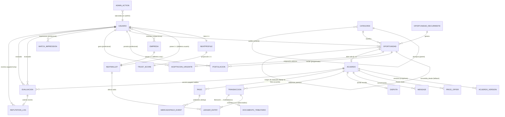

# MER — Modelo Entidad-Relación (conceptual) — NeatSpace
### Tomo Técnico VII · El dominio completo en un solo mapa

**Base:** `docs/01-Arquitectura-NeatSpace.md` §1.2–1.4, los deep-dives 03/04/05, los casos de uso de `docs/06` y las entidades de `specs/schemas/entities.yaml` (28 entidades, ya reconciliadas). Este documento es la **vista conceptual/lógica**: entidades, atributos clave, relaciones y cardinalidades, agrupadas por **contexto acotado** (DDD). El detalle físico (tipos, índices, constraints, DDL) vive en `docs/08-MR.md`.

---

## 1. Contextos acotados (bounded contexts)

El monolito modular (doc 01 §2.2) se organiza en contextos; cada uno **posee** sus entidades y publica eventos. Nada accede a las tablas de otro contexto directamente.

| Contexto | Entidades núcleo | Publica |
|---|---|---|
| **Identidad** | `usuario`, `neatprofile`, `empresa` | — |
| **Catálogo** | `categoria` | — |
| **Oportunidades** | `oportunidad`, `oportunidad_recurrente` | `OportunidadCreada` |
| **NeatMatch** | `aceptacion_urgente`, `match_impression` | `OportunidadTomada` |
| **Sala de Acuerdo** | `acuerdo`, `acuerdo_version`, `price_offer`, `mensaje` | `AcuerdoAceptado`, `TrabajoEntregado`, … |
| **NeatWallet** | `neatwallet`, `transaccion`, `ledger_entry`, `pago`, `mercadopago_event`, `documento_tributario` | `EscrowLiberado`, `ReembolsoEmitido`, … |
| **Reputación** | `evaluacion`, `reputation_log`, `trust_score` | `EvaluacionEnviada` |
| **Conflictos / Gobernanza** | `disputa`, `admin_action` | — |

---

## 2. Diagrama entidad-relación



> **Nota de modelado — `servicio` vs `acuerdo`.** Los endpoints usan tanto `/agreements/{id}` (negociación) como `/services/{id}` (dinero/ejecución). En este MER se modela **un único agregado `acuerdo`** que atraviesa negociación *y* ejecución mediante su máquina de estados; `servicio_id ≡ acuerdo.id`. Separarlos en dos entidades (1-1) es una alternativa válida si se quiere aislar la contabilidad de la negociación. **Decisión a confirmar con Erick.**

---

## 3. Entidades y atributos clave

### 3.1 Identidad y catálogo

- **usuario** — `id`, `email` (UQ), `estado {activo|suspendido}`, `nivel_verificacion`, `creado_en`. Perfil dual: la faceta cliente/profesional es de comportamiento, no de identidad.
- **neatprofile** — `id`, `usuario_id` (FK, 1-1), `nombre`, `descripcion`, `habilidades[]`, `cobertura_geo`. Unidad de reputación.
- **empresa** — `id`, `razon_social`, `giro`. Su billetera se deriva de `neatwallet.empresa_id` (1-1); no hay back-pointer. Miembros vía tabla puente `empresa_miembro` (rol/permisos).
- **categoria** — `id`, `nombre`, `parent_id` (auto-relación, 4 niveles), `sensible` (bool).

### 3.2 Oportunidades y matching

- **oportunidad** — `id`, `cliente_id`, `tipo {urgent|scheduled}` **(inmutable)**, `categoria_id`, `estado {publicado|tomada|cerrada|sin_cobertura}`, `geo_aprox`, `direccion_texto` (revelación condicional), `precio_ref`, `convertida_desde_id` (auto-FK, fallback).
- **oportunidad_recurrente** — `id`, `cliente_id`, `periodicidad`. Genera instancias concretas.
- **postulacion** — `id`, `oportunidad_id`, `profesional_id`, `mensaje`, `creado_en` (modo programado).
- **aceptacion_urgente** — `id`, `oportunidad_id`, `profesional_id`, `creado_en`. **Append-only**, auditable (primero-gana).
- **match_impression** — `id`, `profesional_id`, `categoria_id`, `zona`, `creado_en`. Contador de equidad (ventana 14 días). **Append-only**.

### 3.3 Sala de Acuerdo

- **acuerdo** — `id`, `oportunidad_id` (FK **UQ**, 0..1), `estado` (10 estados, §4), `version_vigente_n`, `aceptado_cliente`, `aceptado_profesional`, `ttl_vence`.
- **acuerdo_version** — `acuerdo_id`, `n`, `terminos {precio, duracion, materiales, responsabilidades, condiciones}`, `aceptado_*_en`, `metodo_verificacion`. **Snapshot inmutable** (append-only).
- **price_offer** — `id`, `acuerdo_id`, `autor_id`, `monto`, `justificacion` (**obligatoria**), `creado_en`. Append-only.
- **mensaje** — `id`, `acuerdo_id`, `autor_id`, `texto`, `leido` (flag acotado, excepción declarada doc 01 §1.4), `alerta_neatai`.
- **disputa** — `id`, `acuerdo_id`, `abierta_por`, `motivo`, `evidencia_url`, `resolucion {pagado|reembolsado|dividido}`, `resuelto_en` (el estado de la disputa lo lleva el `acuerdo` vía `EN_DISPUTA`).

### 3.4 NeatWallet (dinero)

- **neatwallet** — `id`, `tipo {usuario|empresa|sistema}`, `usuario_id?`, `empresa_id?`, `rol_sistema? {escrow|comision|pasarela|reembolsos|recupero|costo_psp}`, `moneda`. **CHECK XOR** de identidad.
- **transaccion** — `id`, `tipo {topup|retencion|liberacion|reembolso|reverso|retiro}`, `referencia_dominio`, `idempotency_key` (UQ). Invariante Σ débitos = Σ créditos.
- **ledger_entry** — `id`, `transaccion_id`, `wallet_id`, `direccion {debito|credito}`, `monto`, `concepto`. **Append-only** (sin UPDATE/DELETE). El saldo es su proyección.
- **pago** — `id`, `acuerdo_id?` (**opcional**: un *topup* de billetera no está atado a ningún acuerdo; solo los cargos de retención lo llevan), `mp_payment_id`, `estado {pendiente|confirmado|fallido|reembolsado|contracargo}`, `monto`.
- **mercadopago_event** — `id` (event-id UQ para dedup), `pago_id`, `payload`, `procesado_en`. Idempotencia del webhook.
- **documento_tributario** — `id`, `transaccion_id` (liberación que lo origina), `emisor_id`, `receptor_id`, `tipo {boleta|factura|nota_credito}`, `monto_bruto`, `retencion`, `folio_sii`. **Append-only**. Gancho legal Ley 21.713/SII (doc 01 §2.5) — a validar con contador.

### 3.5 Reputación

- **evaluacion** — `id`, `servicio_id` (≡ acuerdo), `evaluador_id`, `evaluado_id`, `rol_evaluado {cliente|profesional}?`, `estrellas 1..5`, `atributos` (jsonb), `comentario` (moderado), `visible` (double-blind). **UQ(servicio_id, evaluador_id)**, inmutable.
- **reputation_log** — `id`, `usuario_id`, `evento {evaluacion|sancion|verificacion|apelacion|decay}`, `payload`, `evaluacion_id?`, `hash_prev`, `hash_actual`. **Append-only encadenado por hash**.
- **trust_score** — `neatprofile_id` (PK/FK 1-1), `valor_0_100`, `valor_bayesiano`, `atributos_0_100`, `n_evaluaciones`, `nivel_verificacion`, `recalculado_en`. **Proyección** recomputable del log.

### 3.6 Gobernanza

- **admin_action** — `id`, `tipo`, `objetivo`, `motivo` (**obligatorio**), `maker_id`, `checker_id`, `creado_en`. Doble autorización maker-checker (el ejecutor es `maker_id`); trazable.

---

## 4. Máquina de estados del Acuerdo (referencia)

El `estado` de `acuerdo` gobierna el ciclo completo. Detalle de transiciones en doc 03 §3 y doc 04 §4:

```
ABIERTA → PROPUESTA → (accept dual)
   ├─ retención OK  → ACORDADO → EN_EJECUCION → ENTREGADO → CERRADO
   ├─ retención FALLA → PAGO_FALLIDO → (reintento) → PROPUESTA
   └─ en cualquier punto negociable → CANCELADO | EXPIRADO
ENTREGADO/EN_EJECUCION → EN_DISPUTA → {CERRADO | CANCELADO}   (según resolución)
```

---

## 5. Invariantes conceptuales (se garantizan en el MR)

| # | Invariante | Entidades |
|---|---|---|
| IN-1 | Identidad de billetera **XOR**: usuario **o** empresa **o** sistema, nunca dos. | `neatwallet` |
| IN-2 | Toda `transaccion`: Σ débitos = Σ créditos (≥2 asientos). | `transaccion`, `ledger_entry` |
| IN-3 | `ledger_entry`, `acuerdo_version`, `reputation_log`, `aceptacion_urgente` son **append-only**. | varias |
| IN-4 | Una evaluación por `(servicio, evaluador)`. | `evaluacion` |
| IN-5 | `oportunidad.tipo` es inmutable; el fallback crea una nueva enlazada. | `oportunidad` |
| IN-6 | `acuerdo` ↔ `oportunidad` es **0..1** (FK UQ). | `acuerdo` |
| IN-7 | `trust_score` es proyección: reconstruible desde `reputation_log`. | `trust_score` |
| IN-8 | Cadena de hash de `reputation_log` verificable (`hash_actual = H(hash_prev ‖ payload)`). | `reputation_log` |

---

## 6. Validación contra las restricciones de negocio

| Decisión de modelado | Oportunidades | Confianza | Ética | Largo plazo |
|---|---|---|---|---|
| Contextos acotados con propiedad de datos | ✅ evoluciona por módulo | ✅ | ✅ | ✅✅ sin acoplar |
| Append-only + proyecciones (dinero y reputación) | ➖ | ✅✅ trazable | ✅ auditable | ✅✅ recomputable |
| `acuerdo` como agregado único (servicio≡acuerdo) marcado abierto | ✅ simple | ✅ | ✅ honestidad | ➖ a confirmar |
| Invariantes IN-1..8 declaradas para el MR | ➖ | ✅✅ | ✅ | ✅ |

> **Siguiente:** `docs/08-MR.md` convierte cada entidad en tabla PostgreSQL/PostGIS con tipos, `CHECK`, `UNIQUE`, FKs, índices (GiST geo, equidad NeatMatch, `trust_score DESC`) y las reglas append-only/hash-chain — DDL-ready. Las entidades nuevas (`postulacion`, `disputa`, `mercadopago_event`, `admin_action`, `empresa_miembro`, `acuerdo_aceptacion`, `documento_tributario`) **ya fueron reconciliadas** en `entities.yaml` (28 $defs).
